# IBL Notification System — Developer Documentation

> **Base URL:** `/api/notification/v1/`
> **Authentication:** `Authorization: Token YOUR_ACCESS_TOKEN`
> **API Version:** v1

---

## Table of Contents

1. [Introduction](#1-introduction)
2. [System Overview](#2-system-overview)
3. [Authentication](#3-authentication)
4. [Quickstart](#4-quickstart)
5. [Core Concepts](#5-core-concepts)
6. [Notification Types Reference](#6-notification-types-reference)
7. [API Reference](#7-api-reference)
   - [7.1 Notifications](#71-notifications-api-reference)
   - [7.2 Notification Templates](#72-notification-templates-api-reference)
   - [7.3 Push Notifications](#73-push-notifications)
   - [7.4 SMTP Configuration](#74-smtp-configuration)
   - [7.5 Sending Direct Notifications](#75-sending-direct-notifications)
8. [Template System](#8-template-system)
   - [8.1 How Templates Work](#81-how-templates-work)
   - [8.2 Template Variables](#82-template-variables)
   - [8.3 Customizing Templates](#83-customizing-templates)
   - [8.4 Testing Templates](#84-testing-templates)
   - [8.5 Resetting to Default](#85-resetting-to-default)
9. [Special Notification Types](#9-special-notification-types)
   - [9.1 Human Support Notifications](#91-human-support-notifications)
   - [9.2 Policy Assignment Notifications](#92-policy-assignment-notifications)
   - [9.3 Proactive Learner Notifications (AI-Powered)](#93-proactive-learner-notifications-ai-powered)
10. [Notification Preferences](#10-notification-preferences)
11. [Platform SMTP Configuration](#11-platform-smtp-configuration)
12. [Notification Lifecycle](#12-notification-lifecycle)
13. [Error Reference](#13-error-reference)
14. [Rate Limits and Best Practices](#14-rate-limits-and-best-practices)

---

## 1. Introduction

The IBL Notification System provides multi-channel notification delivery for the IBL learning platform. It handles routing, templating, and delivery of notifications to learners, administrators, and other platform participants across email, push, and in-app channels.

### Supported Channels

- **Email** — Delivered via configured SMTP
- **Push Notifications** — Delivered to registered mobile or browser clients via FCM
- **In-App** — Surfaced within the IBL platform UI and accessible via API

### Key Capabilities

- Multi-channel delivery with per-channel enable/disable controls
- 22+ built-in notification types triggered automatically by platform events (enrollments, completions, credential issuance, and more)
- Customizable notification templates for your platform with inheritance from defaults — your edits apply to a copy, not the original
- Enable or disable specific notification types for your platform
- AI-powered proactive learner notifications for engagement and progress recommendations (optional, requires configuration)
- Human support ticket routing with configurable recipient lists

### Delivery Overview

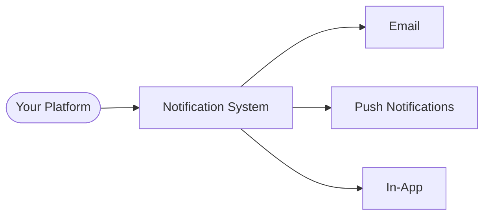

---

## 2. System Overview

The notification system operates on an event-driven model. Actions within your platform — such as a learner completing a course, a manager sending an invitation, or a policy being assigned — trigger notifications. The system evaluates your configuration, selects the appropriate template, and delivers the notification through the enabled channels.

Your templates, preferences, and recipient rules are scoped to your platform only.

### How Notifications Are Generated

Notifications reach your users through two paths:

**Automatic** — Events on your platform trigger notifications without any action from you. When a learner enrolls in a course, completes a credential, or receives a license assignment, the system generates and delivers the corresponding notification. For each event, the system checks:

1. Whether the notification type is enabled for your platform
2. Which channels are configured for delivery
3. Which template applies (your customized version or the inherited default)
4. Who the recipients are

**Manual (Direct Send)** — You compose and send notifications on demand using the Direct Send API. You select a template or write custom content, choose delivery channels, and define your audience from multiple sources (email addresses, usernames, user groups, departments, programs, or CSV uploads). Recipients are merged and deduplicated across sources before sending.

Both paths deliver through the same channels and respect your platform's template and preference configuration.

### Admin and User Interaction Points

As a platform admin, you use the Admin API to:
- Enable or disable notification types for your platform
- Customize templates (your edits apply to a copy of the default)
- Configure human support routing recipients
- Control AI-powered proactive notification settings
- Send direct notifications to targeted recipients

Your users use the User API to:
- Retrieve their notification list
- Mark notifications as read
- Dismiss notifications

### System Flow

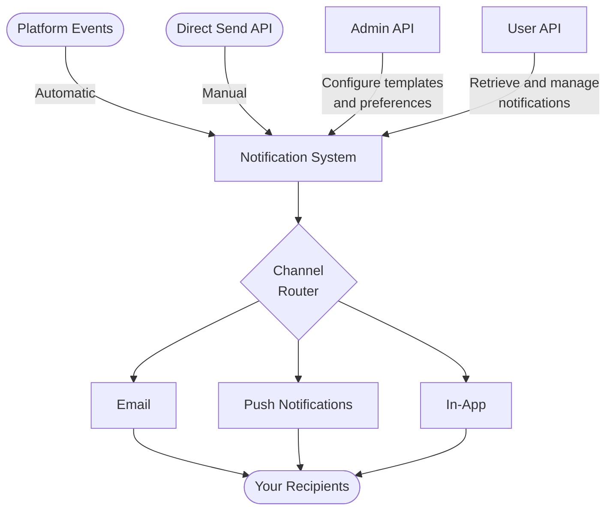

### Notification Lifecycle

Each notification begins as `UNREAD` when delivered. Your users can mark them as `READ` or `CANCELLED`. A `READ` notification can be reverted to `UNREAD`, but `CANCELLED` is terminal.

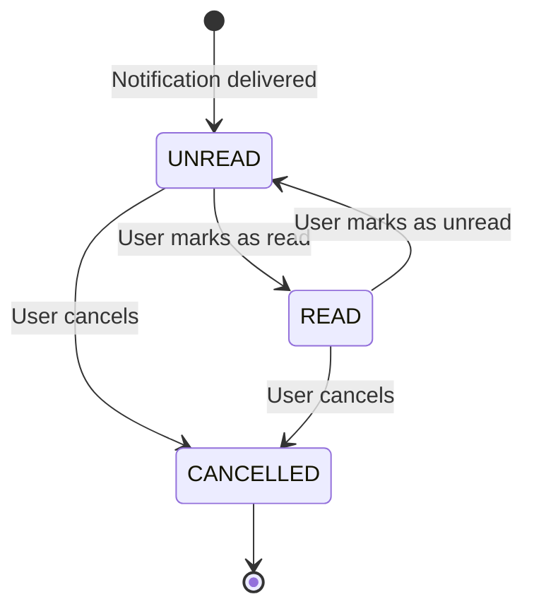

---

## 3. Authentication

All Notification API endpoints require token-based authentication. Requests must include a valid access token in the `Authorization` header:

```
Authorization: Token YOUR_ACCESS_TOKEN
```

Obtain a token from your platform's authentication endpoint. Tokens are scoped to a user identity and validated on every request.

### Permission Levels

| Action | Required Role |
|---|---|
| Read own notifications | Authenticated user |
| Manage own notifications (read/unread/delete) | Authenticated user |
| List/customize templates | Platform Admin |
| Toggle notification types | Platform Admin |
| Test SMTP credentials | Platform Admin |
| Send direct notifications | Platform Admin or Department Admin |

### Example Request

```bash
curl -X GET "https://platform.iblai.app/api/notification/v1/orgs/acme-learning/users/jane.doe/notifications/" \
  -H "Authorization: Token YOUR_ACCESS_TOKEN" \
  -H "Content-Type: application/json"
```

### RBAC

If RBAC is enabled on your platform, permissions are validated against granular resource actions in addition to role checks. For example, listing notifications requires `Ibl.Notifications/Notification/list` and writing requires `Ibl.Notifications/Notification/write`. A role check alone is not sufficient when RBAC enforcement is active — the token's associated user must also hold the relevant resource action grant.

### Security

Store tokens securely on the server side. Never expose tokens in client-side JavaScript, browser storage accessible to third-party scripts, or version control. Treat a token with the same care as a password — it grants full API access as the authenticated user.

---

## 4. Quickstart

### Prerequisites

- **API token** — Pass it in every request as `Authorization: Token YOUR_ACCESS_TOKEN`.
- **Platform key** — The slug that identifies your organisation (e.g., `acme-learning`). This appears as the `org` or `platform_key` path segment in every URL.

---

### Step 1: List Notifications for a User

Retrieve a paginated list of notifications. Unread notifications are returned first, followed by read ones in reverse-chronological order.

```
GET /api/notification/v1/orgs/{org}/users/{user_id}/notifications/
```

**Query parameters (all optional)**

| Parameter | Description |
|---|---|
| `status` | Filter by status: `UNREAD`, `READ` |
| `channel` | Filter by delivery channel (e.g. `email`, `push_notification`) |
| `exclude_channel` | Exclude a specific channel from results |
| `start_date` | Return notifications created on or after this date |
| `end_date` | Return notifications created on or before this date |

```bash
curl -X GET \
  "https://platform.iblai.app/api/notification/v1/orgs/acme-learning/users/jane.doe/notifications/" \
  -H "Authorization: Token YOUR_ACCESS_TOKEN"
```

**Response**

```json
{
  "count": 2,
  "next": null,
  "previous": null,
  "results": [
    {
      "id": "3fa85f64-5717-4562-b3fc-2c963f66afa6",
      "username": "jane.doe",
      "title": "New course available: Introduction to Data Science",
      "body": "<p>Hi Jane, you have been enrolled in Introduction to Data Science.</p>",
      "status": "UNREAD",
      "channel": "email",
      "context": {
        "course_name": "Introduction to Data Science",
        "username": "jane.doe"
      },
      "short_message": "You have been enrolled in Introduction to Data Science.",
      "created_at": "2026-04-11T08:30:00Z",
      "updated_at": "2026-04-11T08:30:00Z"
    },
    {
      "id": "7cb92a41-1e3d-4f8b-a2c6-9d0e5f7b3a12",
      "username": "jane.doe",
      "title": "Your certificate is ready",
      "body": "<p>Your certificate for Python Fundamentals is ready to download.</p>",
      "status": "READ",
      "channel": "email",
      "context": {
        "course_name": "Python Fundamentals",
        "username": "jane.doe"
      },
      "short_message": "Your Python Fundamentals certificate is ready.",
      "created_at": "2026-04-10T14:15:00Z",
      "updated_at": "2026-04-10T14:22:00Z"
    }
  ]
}
```

**Response fields**

| Field | Type | Description |
|---|---|---|
| `id` | UUID | Unique notification identifier |
| `username` | string | Recipient's username |
| `title` | string | Rendered notification title |
| `body` | string | Rendered full body (may contain HTML) |
| `status` | string | `UNREAD`, `READ`, or `CANCELLED` |
| `channel` | string or null | Delivery channel name |
| `context` | object | Template variables used to render this notification |
| `short_message` | string | Short summary for push notification previews |
| `created_at` | ISO 8601 | Creation timestamp |
| `updated_at` | ISO 8601 | Last status change timestamp |

---

### Step 2: Check Unread Count

```
GET /api/notification/v1/orgs/{org}/users/{user_id}/notifications-count/?status=UNREAD
```

```bash
curl -X GET \
  "https://platform.iblai.app/api/notification/v1/orgs/acme-learning/users/jane.doe/notifications-count/?status=UNREAD" \
  -H "Authorization: Token YOUR_ACCESS_TOKEN"
```

```json
{
  "count": 5
}
```

---

### Step 3: Mark a Notification as Read

```
PUT /api/notification/v1/orgs/{org}/users/{user_id}/notifications/
```

```bash
curl -X PUT \
  "https://platform.iblai.app/api/notification/v1/orgs/acme-learning/users/jane.doe/notifications/" \
  -H "Authorization: Token YOUR_ACCESS_TOKEN" \
  -H "Content-Type: application/json" \
  -d '{
    "notification_id": "3fa85f64-5717-4562-b3fc-2c963f66afa6",
    "status": "READ"
  }'
```

To mark multiple notifications, pass a comma-separated list:

```json
{
  "notification_id": "3fa85f64-5717-4562-b3fc-2c963f66afa6,7cb92a41-1e3d-4f8b-a2c6-9d0e5f7b3a12",
  "status": "READ"
}
```

```json
{
  "message": "Notification status updated successfully",
  "success": true
}
```

---

### Step 4: Mark All Notifications as Read

```
POST /api/notification/v1/orgs/{platform_key}/mark-all-as-read
```

```bash
curl -X POST \
  "https://platform.iblai.app/api/notification/v1/orgs/acme-learning/mark-all-as-read" \
  -H "Authorization: Token YOUR_ACCESS_TOKEN" \
  -H "Content-Type: application/json" \
  -d '{}'
```

To mark a specific subset, provide `notification_ids`:

```json
{
  "notification_ids": [
    "3fa85f64-5717-4562-b3fc-2c963f66afa6",
    "7cb92a41-1e3d-4f8b-a2c6-9d0e5f7b3a12"
  ]
}
```

**Response**

```json
{
  "message": "Successfully marked 5 notifications as read",
  "count": 5
}
```

This endpoint operates on the authenticated user derived from the token. The `platform_key` scopes the operation to your platform only.

---

### What's Next

- **[Template Customization (Section 8)](#8-template-system):** Edit notification templates, override subject lines and HTML bodies, use template variables.
- **[Notification Preferences (Section 10)](#10-notification-preferences):** Enable or disable notification types for your platform.
- **[SMTP Setup (Section 11)](#11-platform-smtp-configuration):** Connect your SMTP server and verify credentials.

---

## 5. Core Concepts

| Concept | Description |
|---------|-------------|
| **Platform** | Your isolated notification environment. Templates, preferences, and delivery settings are scoped to your platform. |
| **Notification Template** | Defines content, channels, and behavior for a notification type. You inherit defaults until you customize — your changes apply to your own copy only. |
| **Notification** | A sent notification record tied to a user, with delivery and read status tracking. |
| **Channel** | A delivery method: `email`, `push_notification`, or `sms`. |
| **Notification Type** | A category of notification (e.g., `USER_NOTIF_COURSE_ENROLLMENT`). Each type maps to one template for your platform. |
| **Notification Preference** | A platform-level toggle that enables or disables a notification type for all users on your platform. |

### How Template Inheritance Works

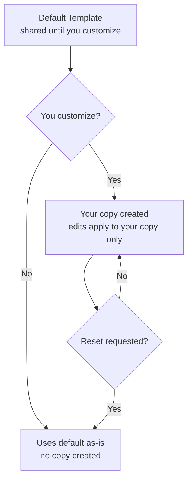

---

## 6. Notification Types Reference

| Type | Category | Trigger | Description |
|------|----------|---------|-------------|
| `USER_NOTIF_USER_REGISTRATION` | User | User account created | Welcomes new users to the platform |
| `APP_REGISTRATION` | User | User registers via a linked application | Welcome message with app name and benefits |
| `USER_NOTIF_COURSE_ENROLLMENT` | Learning | Enrolled in a course | Confirms course enrollment to the learner |
| `USER_NOTIF_COURSE_COMPLETION` | Learning | Completed a course | Congratulates on course completion with certificate link |
| `USER_NOTIF_CREDENTIALS` | Learning | Credential issued | Notifies learner of new credential with credential URL |
| `USER_NOTIF_LEARNER_PROGRESS` | Learning | Periodic progress summary | Delivers progress digest with courses, time spent, credentials |
| `USER_NOTIF_USER_INACTIVITY` | Engagement | User inactive for configured period | Re-engagement notification with inactivity details |
| `PLATFORM_INVITATION` | Invitation | Admin sends platform invite | Invites user to join the platform with redirect link |
| `COURSE_INVITATION` | Invitation | Admin sends course invite | Invites user to a course with enrollment link |
| `PROGRAM_INVITATION` | Invitation | Admin sends program invite | Invites user to a program with enrollment link |
| `COURSE_LICENSE_ASSIGNMENT` | License | Course license assigned to user | Notifies user of course access via license |
| `COURSE_LICENSE_GROUP_ASSIGNMENT` | License | Course license assigned to user group | Notifies group members of course access |
| `PROGRAM_LICENSE_ASSIGNMENT` | License | Program license assigned to user | Notifies user of program access via license |
| `PROGRAM_LICENSE_GROUP_ASSIGNMENT` | License | Program license assigned to user group | Notifies group members of program access |
| `USER_LICENSE_ASSIGNMENT` | License | Platform user license assigned | Notifies user of platform license with benefits |
| `USER_LICENSE_GROUP_ASSIGNMENT` | License | Platform user license assigned to group | Notifies group members of platform license |
| `ROLE_CHANGE` | Admin | User's platform role changed | Notifies user of role promotion or demotion |
| `ADMIN_NOTIF_COURSE_ENROLLMENT` | Admin | User enrolls in a course | Alerts admins with student name, email, and course |
| `POLICY_ASSIGNMENT` | RBAC | RBAC policy assigned or removed | Notifies user of role assignment/removal with resources |
| `HUMAN_SUPPORT_NOTIFICATION` | Support | Human support ticket created | Alerts support staff with ticket details and chat link |
| `PROACTIVE_LEARNER_NOTIFICATION` | AI | Scheduled | AI-generated personalized learning recommendations |
| `REPORT_COMPLETED` | Admin | Async report finishes processing | Notifies user with report status and download URL |
| `CUSTOM_NOTIFICATION` | Custom | Code-driven | Platform-defined custom notification with custom targeting |

---

## 7. API Reference

**Base path:** `/api/notification/v1/`

**Authentication:** `Token` header required on all endpoints unless noted otherwise.

---

### 7.1 Notifications API Reference

#### Summary

| Method | Endpoint | Auth | RBAC Permission | Description |
|--------|----------|------|-----------------|-------------|
| GET | `/orgs/{org}/notifications/` | Token | `Ibl.Notifications/Notification/list` | List paginated notifications scoped to the org |
| PUT | `/orgs/{org}/notifications/` | Token | `Ibl.Notifications/Notification/write` | Update notification status scoped to the org |
| PATCH | `/orgs/{org}/notifications/bulk-update/` | Token | `Ibl.Notifications/Notification/write` | Bulk status update scoped to the org |
| GET | `/orgs/{org}/users/{user_id}/notifications/` | Token | `Ibl.Notifications/Notification/list` | List paginated notifications for a specific user |
| PUT | `/orgs/{org}/users/{user_id}/notifications/` | Token | `Ibl.Notifications/Notification/write` | Update status of one or more notifications by ID |
| PATCH | `/orgs/{org}/users/{user_id}/notifications/bulk-update/` | Token | `Ibl.Notifications/Notification/write` | Set a single status across all of a user's notifications |
| DELETE | `/orgs/{org}/users/{user_id}/notifications/{id}/` | Token | `Ibl.Notifications/Notification/delete` | Delete a single notification |
| GET | `/orgs/{org}/users/{user_id}/notifications-count/` | Token | `Ibl.Notifications/Notification/list` | Return count of notifications matching filters |
| POST | `/orgs/{platform_key}/mark-all-as-read` | Token | `Ibl.Notifications/Notification/write` | Mark all unread notifications as read |

---

#### GET `/orgs/{org}/users/{user_id}/notifications/`

List notifications for a specific user on your platform. Results are ordered with unread notifications first, then by creation date descending. Paginated.

**Path parameters**

| Name | Type | Description |
|------|------|-------------|
| `org` | string (slug) | Platform key |
| `user_id` | string | Username of the target user |

**Query parameters**

| Name | Type | Required | Description |
|------|------|----------|-------------|
| `status` | string | No | Filter by status: `READ`, `UNREAD`, `CANCELLED` |
| `channel` | string | No | Filter by channel name (e.g. `email`, `push_notification`) |
| `start_date` | string | No | Notifications created on or after this date |
| `end_date` | string | No | Notifications created on or before this date |
| `exclude_channel` | string | No | Exclude a specific channel |
| `page` | integer | No | Page number for pagination |

**Response** `200 OK`

```json
{
  "count": 2,
  "next": 2,
  "previous": null,
  "results": [
    {
      "id": "3fa85f64-5717-4562-b3fc-2c963f66afa6",
      "username": "jane.doe",
      "title": "Your course certificate is ready",
      "body": "<p>Your certificate for <strong>Intro to Data Science</strong> is now available.</p>",
      "status": "UNREAD",
      "channel": "email",
      "context": {
        "course_name": "Intro to Data Science",
        "username": "jane.doe"
      },
      "short_message": "Your certificate for Intro to Data Science is ready.",
      "created_at": "2026-04-10T14:23:01.123456Z",
      "updated_at": "2026-04-10T14:23:01.123456Z"
    }
  ]
}
```

**Response fields**

| Field | Type | Description |
|-------|------|-------------|
| `count` | integer | Total notifications matching the query |
| `next` | integer or null | Next page number |
| `previous` | integer or null | Previous page number |
| `results[].id` | UUID | Unique notification identifier |
| `results[].username` | string or null | Recipient's username |
| `results[].title` | string | Rendered notification title |
| `results[].body` | string | Rendered body (may contain HTML) |
| `results[].status` | string | `READ`, `UNREAD`, or `CANCELLED` |
| `results[].channel` | string or null | Delivery channel name |
| `results[].context` | object or null | Template context variables used for rendering |
| `results[].short_message` | string | Short message for SMS or preview |
| `results[].created_at` | ISO 8601 | Creation timestamp |
| `results[].updated_at` | ISO 8601 | Last update timestamp |

```bash
curl -X GET "https://platform.iblai.app/api/notification/v1/orgs/acme-learning/users/jane.doe/notifications/?status=UNREAD" \
  -H "Authorization: Token YOUR_ACCESS_TOKEN"
```

---

#### PUT `/orgs/{org}/users/{user_id}/notifications/`

Update the status of one or more notifications by UUID.

**Request body**

| Field | Type | Required | Description |
|-------|------|----------|-------------|
| `notification_id` | string | Yes | Comma-separated notification UUIDs |
| `status` | string | Yes | `READ`, `UNREAD`, or `CANCELLED` |

```json
{
  "notification_id": "3fa85f64-5717-4562-b3fc-2c963f66afa6,7cb93e21-1234-4abc-9876-def012345678",
  "status": "READ"
}
```

**Response** `200 OK`

```json
{
  "message": "Notification status updated successfully",
  "success": true
}
```

---

#### PATCH `/orgs/{org}/users/{user_id}/notifications/bulk-update/`

Set a single status on **all** notifications for the specified user on your platform.

**Request body**

| Field | Type | Required | Description |
|-------|------|----------|-------------|
| `status` | string | Yes | `READ`, `UNREAD`, or `CANCELLED` |

**Response** `200 OK`

```json
{
  "message": "Notification status updated successfully"
}
```

**Error** `400 Bad Request` — returned when the user has no notifications.

```json
{
  "error": "Notification does not exist"
}
```

---

#### DELETE `/orgs/{org}/users/{user_id}/notifications/{id}/`

Permanently delete a single notification.

**Path parameters**

| Name | Type | Description |
|------|------|-------------|
| `org` | string | Platform key |
| `user_id` | string | Username |
| `id` | string | Notification ID |

**Response** `200 OK`

```json
{
  "message": "Notification deleted successfully"
}
```

**Error** `404 Not Found`

```json
{
  "message": "Notification does not exist"
}
```

---

#### GET `/orgs/{org}/users/{user_id}/notifications-count/`

Return the count of notifications for a user.

**Query parameters**

| Name | Type | Required | Description |
|------|------|----------|-------------|
| `status` | string | No | `READ`, `UNREAD`, or `CANCELLED` |
| `channel` | string | No | Filter by channel name |

**Response** `200 OK`

```json
{
  "count": 5
}
```

---

#### POST `/orgs/{platform_key}/mark-all-as-read`

Mark all unread notifications as read for the authenticated user on the platform. Optionally restrict to specific IDs.

**Request body**

| Field | Type | Required | Description |
|-------|------|----------|-------------|
| `notification_ids` | array of UUIDs | No | If provided, only these are marked. If omitted, all unread are marked. |

**Response** `200 OK`

```json
{
  "message": "Successfully marked 3 notifications as read",
  "count": 3
}
```

---

### 7.2 Notification Templates API Reference

All template endpoints require **Platform Admin** role.

#### Summary

| Method | Endpoint | Auth | Role | Description |
|--------|----------|------|------|-------------|
| GET | `/platforms/{platform_key}/templates/` | Token | Platform Admin | List all templates |
| GET | `/platforms/{platform_key}/templates/{type}/` | Token | Platform Admin | Get template detail |
| PATCH | `/platforms/{platform_key}/templates/{type}/` | Token | Platform Admin | Customize a template (creates your copy on first edit) |
| PATCH | `/platforms/{platform_key}/templates/{type}/toggle/` | Token | Platform Admin | Enable or disable a notification type |
| POST | `/platforms/{platform_key}/templates/{type}/reset/` | Token | Platform Admin | Reset to default |
| POST | `/platforms/{platform_key}/templates/{type}/test/` | Token | Platform Admin | Send a test notification |

---

#### GET `/platforms/{platform_key}/templates/`

Returns every notification template visible to your platform, including inherited defaults and your customized overrides. Custom notification types are appended after system types.

**Response** `200 OK`

```json
[
  {
    "id": 14,
    "type": "USER_NOTIF_COURSE_ENROLLMENT",
    "name": "Course Enrollment",
    "description": "Sent when a learner enrolls in a course",
    "is_inherited": false,
    "source_platform": "acme-learning",
    "is_enabled": true,
    "can_customize": true,
    "is_custom": false,
    "message_title": "You have been enrolled in {{ course_name }}",
    "email_subject": "Welcome to {{ course_name }}",
    "spas": ["skills", "admin"],
    "allowed_channels": ["email", "push_notification"],
    "available_context": {
      "username": "Learner's username",
      "course_name": "Name of the course",
      "site_name": "Platform display name"
    }
  }
]
```

**Response fields**

| Field | Type | Description |
|-------|------|-------------|
| `id` | UUID or string | Template ID. Custom notification types use a `custom_<id>` string format. |
| `type` | string | Notification type key |
| `name` | string | Human-readable name |
| `description` | string | When this notification is sent |
| `is_inherited` | boolean | `true` if using the unmodified default template |
| `source_platform` | string | Platform key that owns the active template |
| `is_enabled` | boolean | Whether this type is enabled for the platform |
| `can_customize` | boolean | Whether template content is editable |
| `is_custom` | boolean | `true` for custom notification types |
| `message_title` | string | Push/in-app title |
| `email_subject` | string | Email subject line |
| `spas` | array of strings | SPAs that surface this notification |
| `allowed_channels` | array of strings | Delivery channels |
| `available_context` | object | Variable keys and descriptions |

---

#### GET `/platforms/{platform_key}/templates/{type}/`

Returns full content and configuration of a single template. If you have a customized template, that is returned; otherwise the default template is returned with `is_inherited: true`.

**Response** `200 OK`

```json
{
  "id": 14,
  "type": "USER_NOTIF_COURSE_ENROLLMENT",
  "name": "Course Enrollment",
  "description": "Sent when a learner enrolls in a course",
  "message_title": "You have been enrolled in {{ course_name }}",
  "message_body": "Hi {{ username }}, you have been enrolled in {{ course_name }}.",
  "short_message_body": "Enrolled in {{ course_name }}",
  "email_subject": "Welcome to {{ course_name }}",
  "email_from_address": "no-reply@acme-learning.com",
  "email_html_template": "<p>Hi {{ username }},</p><p>You have been enrolled in <strong>{{ course_name }}</strong>.</p>",
  "spas_detail": [
    {"id": 2, "name": "skills", "description": "Skills SPA"}
  ],
  "allowed_channels_detail": [
    {"id": 1, "name": "email"},
    {"id": 3, "name": "push_notification"}
  ],
  "is_inherited": false,
  "is_enabled": true,
  "source_platform": "acme-learning",
  "can_customize": true,
  "metadata": {},
  "available_context": {
    "username": "Learner's username",
    "course_name": "Name of the course"
  },
  "periodic_config": null,
  "policy_config": null,
  "human_support_config": null,
  "created_at": "2025-03-01T09:00:00Z",
  "updated_at": "2025-11-15T14:32:00Z"
}
```

**Additional response fields (detail only)**

| Field | Type | Description |
|-------|------|-------------|
| `message_body` | string | Full body text |
| `short_message_body` | string | Short version for SMS/preview |
| `email_from_address` | string | Sender email |
| `email_html_template` | string | HTML email body |
| `spas_detail` | array | SPA objects with `id`, `name`, `description` |
| `allowed_channels_detail` | array | Channel objects with `id`, `name` |
| `metadata` | object | Raw configuration blob |
| `periodic_config` | object or null | Schedule config (for `PROACTIVE_LEARNER_NOTIFICATION` only) |
| `policy_config` | object or null | Role config (for `POLICY_ASSIGNMENT` only) |
| `human_support_config` | object or null | Recipient config (for `HUMAN_SUPPORT_NOTIFICATION` only) |

**`periodic_config` fields** (when present)

| Field | Type | Description |
|-------|------|-------------|
| `learner_scope` | string | `ACTIVE_LEARNERS` or `ALL_LEARNERS` |
| `report_period_days` | integer | Days of activity to include |
| `frequency` | string | `DAILY`, `WEEKLY`, `MONTHLY`, or `CUSTOM` |
| `custom_interval_days` | integer or null | Interval when frequency is `CUSTOM` |
| `execution_time` | string | `HH:MM` (24-hour) |
| `timezone` | string | Timezone name |
| `agents` | array | Agent configs: `[{"unique_id", "prompt", "name"}]` |
| `last_execution_date` | string or null | ISO 8601 date of last run |
| `next_execution_date` | string or null | ISO 8601 date of next run |

**`policy_config` fields** (when present)

| Field | Type | Description |
|-------|------|-------------|
| `enabled_policies` | array | Per-role configs: `[{"role_name", "enabled", "subject"}]` |
| `notify_on_assignment` | boolean | Notify on policy assignment |
| `notify_on_removal` | boolean | Notify on policy removal |

**`human_support_config` fields** (when present)

| Field | Type | Description |
|-------|------|-------------|
| `recipient_mode` | string | `platform_admins_and_mentor_owner`, `platform_admins_only`, `mentor_owner_only`, or `custom` |
| `custom_recipients` | array | Recipient targets when mode is `custom` |

---

#### PATCH `/platforms/{platform_key}/templates/{type}/`

Customize a notification template. On the first PATCH for a given type, the system creates your own copy of the default template and applies the changes. Subsequent PATCHes update your existing copy. Only fields present in the request body are changed.

**Writable fields**

| Field | Type | Description |
|-------|------|-------------|
| `name` | string | Template display name |
| `description` | string | Description |
| `message_title` | string | Push/in-app title |
| `message_body` | string | Body text |
| `short_message_body` | string | Short version |
| `email_subject` | string | Email subject |
| `email_from_address` | string | Sender email |
| `email_html_template` | string | HTML email body |
| `spa_ids` | array of integers | SPA IDs |
| `channel_ids` | array of integers | Channel IDs |

**Periodic config fields** (for `PROACTIVE_LEARNER_NOTIFICATION`)

| Field | Type | Description |
|-------|------|-------------|
| `periodic_learner_scope` | string | `ACTIVE_LEARNERS` or `ALL_LEARNERS` |
| `periodic_report_period_days` | integer (1–365) | Report window |
| `periodic_frequency` | string | `DAILY`, `WEEKLY`, `MONTHLY`, `CUSTOM` |
| `periodic_custom_interval_days` | integer (1–365) | Interval for `CUSTOM` |
| `periodic_execution_time` | string | `HH:MM` format |
| `periodic_timezone` | string | Timezone name |
| `periodic_mentors` | array | Agent configs |

**Policy config fields** (for `POLICY_ASSIGNMENT`)

| Field | Type | Description |
|-------|------|-------------|
| `policy_enabled_policies` | array | Per-role config |
| `policy_notify_on_assignment` | boolean | Notify on assignment |
| `policy_notify_on_removal` | boolean | Notify on removal |

**Human support config fields** (for `HUMAN_SUPPORT_NOTIFICATION`)

| Field | Type | Description |
|-------|------|-------------|
| `human_support_recipient_mode` | string | Recipient mode |
| `human_support_custom_recipients` | array | Custom recipients |

**Example request**

```bash
curl -X PATCH "https://platform.iblai.app/api/notification/v1/platforms/acme-learning/templates/USER_NOTIF_COURSE_ENROLLMENT/" \
  -H "Authorization: Token YOUR_ACCESS_TOKEN" \
  -H "Content-Type: application/json" \
  -d '{
    "email_subject": "Welcome to {{ course_name }} on Acme Learning",
    "message_title": "Enrollment confirmed: {{ course_name }}"
  }'
```

Returns the full updated template in the same shape as the detail response.

---

#### PATCH `/platforms/{platform_key}/templates/{type}/toggle/`

Enable or disable a notification type. This does not modify template content.

**Request body**

| Field | Type | Required | Description |
|-------|------|----------|-------------|
| `allow_notification` | boolean | Yes | `true` to enable; `false` to disable |

```bash
curl -X PATCH "https://platform.iblai.app/api/notification/v1/platforms/acme-learning/templates/USER_NOTIF_COURSE_ENROLLMENT/toggle/" \
  -H "Authorization: Token YOUR_ACCESS_TOKEN" \
  -H "Content-Type: application/json" \
  -d '{"allow_notification": false}'
```

**Response** `200 OK`

```json
{
  "type": "USER_NOTIF_COURSE_ENROLLMENT",
  "is_enabled": false,
  "platform": "acme-learning",
  "message": "Notification disabled successfully"
}
```

---

#### POST `/platforms/{platform_key}/templates/{type}/reset/`

Deletes your customized template. Your platform falls back to the default template. The toggle state (enabled/disabled) is not affected.

No request body required.

```bash
curl -X POST "https://platform.iblai.app/api/notification/v1/platforms/acme-learning/templates/USER_NOTIF_COURSE_ENROLLMENT/reset/" \
  -H "Authorization: Token YOUR_ACCESS_TOKEN"
```

**Response** `200 OK`

```json
{
  "message": "Template reset to default. Platform will now use main template.",
  "deleted": true
}
```

If no platform override existed:

```json
{
  "message": "Template was already using default from main platform.",
  "deleted": false
}
```

---

#### POST `/platforms/{platform_key}/templates/{type}/test/`

Send a test email using the template. The email is sent to the requesting admin's email address.

**Request body**

| Field | Type | Required | Description |
|-------|------|----------|-------------|
| `context` | object | No | Key-value pairs injected into the template. Overrides defaults. |

Default context (auto-injected): `username`, `site_name`, `course_name`, `platform_key`.

```bash
curl -X POST "https://platform.iblai.app/api/notification/v1/platforms/acme-learning/templates/USER_NOTIF_COURSE_ENROLLMENT/test/" \
  -H "Authorization: Token YOUR_ACCESS_TOKEN" \
  -H "Content-Type: application/json" \
  -d '{
    "context": {
      "course_name": "Introduction to Machine Learning"
    }
  }'
```

**Response** `200 OK`

```json
{
  "success": true,
  "message": "Test notification sent successfully to admin@acme-learning.com",
  "recipient": "admin@acme-learning.com"
}
```

**Response** `500` — delivery failure

```json
{
  "success": false,
  "message": "Failed to send test notification. Check email configuration."
}
```

---

### 7.3 Push Notifications

Push notifications allow your platform to send real-time alerts via Firebase Cloud Messaging (FCM).

> These endpoints are only available when push notifications are enabled on your platform.

#### Register FCM Device Token

```
POST /api/notification/v1/orgs/{org}/users/{user_id}/register-fcm-token/
```

**Request body**

| Field | Type | Required | Default | Description |
|-------|------|----------|---------|-------------|
| `name` | string | Yes | — | Device or app name |
| `registration_id` | string | Yes | — | FCM device registration token |
| `active` | boolean | No | `true` | Whether this registration is active |
| `cloud_message_type` | string | No | `"FCM"` | Cloud messaging type |
| `application_id` | string | No | `"ibl_fcm_app"` | Application identifier |

```bash
curl -X POST \
  "https://platform.iblai.app/api/notification/v1/orgs/acme-learning/users/john.doe/register-fcm-token/" \
  -H "Authorization: Token YOUR_ACCESS_TOKEN" \
  -H "Content-Type: application/json" \
  -d '{
    "name": "John iPhone 15",
    "registration_id": "eX3ampleFCMToken:APA91bHPRgkF..."
  }'
```

**Response** `200 OK`

```json
{
  "success": true,
  "message": "Token created successfully"
}
```

#### Remove FCM Device Token

```
DELETE /api/notification/v1/orgs/{org}/users/{user_id}/register-fcm-token/
```

**Request body**

| Field | Type | Required | Description |
|-------|------|----------|-------------|
| `registration_id` | string | Yes | Device registration token to remove |

```bash
curl -X DELETE \
  "https://platform.iblai.app/api/notification/v1/orgs/acme-learning/users/john.doe/register-fcm-token/" \
  -H "Authorization: Token YOUR_ACCESS_TOKEN" \
  -H "Content-Type: application/json" \
  -d '{"registration_id": "eX3ampleFCMToken:APA91bHPRgkF..."}'
```

**Response** `200 OK`

```json
{
  "success": true,
  "message": "Registration ID delete successfully"
}
```

---

### 7.4 SMTP Configuration

#### Test SMTP Credentials

Opens a live SMTP connection and sends a test email to verify credentials.

```
POST /api/notification/v1/platforms/{platform_key}/config/test-smtp/
```

**Auth:** Token, Platform Admin (`Ibl.Notifications/SMTP/action`)

**Request body**

| Field | Type | Required | Default | Description |
|-------|------|----------|---------|-------------|
| `smtp_host` | string | Yes | — | SMTP server hostname |
| `smtp_port` | integer | Yes | — | SMTP server port (1–65535) |
| `smtp_username` | string | Yes | — | SMTP username |
| `smtp_password` | string | Yes | — | SMTP password (write-only) |
| `use_tls` | boolean | No | `true` | Enable STARTTLS |
| `use_ssl` | boolean | No | `false` | Enable SSL/TLS on connect |
| `test_email` | email | Yes | — | Recipient for the test email |
| `from_email` | email | No | — | Sender address (defaults to `smtp_username`) |

> `use_tls` and `use_ssl` are mutually exclusive. Use `use_tls: true` with port 587 or `use_ssl: true` with port 465.

```bash
curl -X POST \
  "https://platform.iblai.app/api/notification/v1/platforms/acme-learning/config/test-smtp/" \
  -H "Authorization: Token YOUR_ACCESS_TOKEN" \
  -H "Content-Type: application/json" \
  -d '{
    "smtp_host": "smtp.gmail.com",
    "smtp_port": 587,
    "smtp_username": "notifications@example.com",
    "smtp_password": "app-specific-password",
    "use_tls": true,
    "use_ssl": false,
    "test_email": "verify@example.com",
    "from_email": "notifications@example.com"
  }'
```

**Response** `200 OK`

```json
{
  "success": true,
  "status": "success",
  "message": "Test email sent successfully to verify@example.com. Please check your inbox to confirm delivery."
}
```

**Response** `500` — authentication failure

```json
{
  "success": false,
  "status": "error",
  "message": "SMTP test failed: Authentication failed. Please check your username and password."
}
```

**Response** `500` — connection failure

```json
{
  "success": false,
  "status": "error",
  "message": "SMTP test failed: Connection failed. Please check your host and port settings."
}
```

---

### 7.5 Sending Direct Notifications

Send notifications on demand to any combination of recipients on your platform. You select a template or write custom content, choose delivery channels, define your audience from multiple sources, preview the recipient list, and send.

**Auth:** Token, Platform Admin or Department Admin

#### Builder Flow

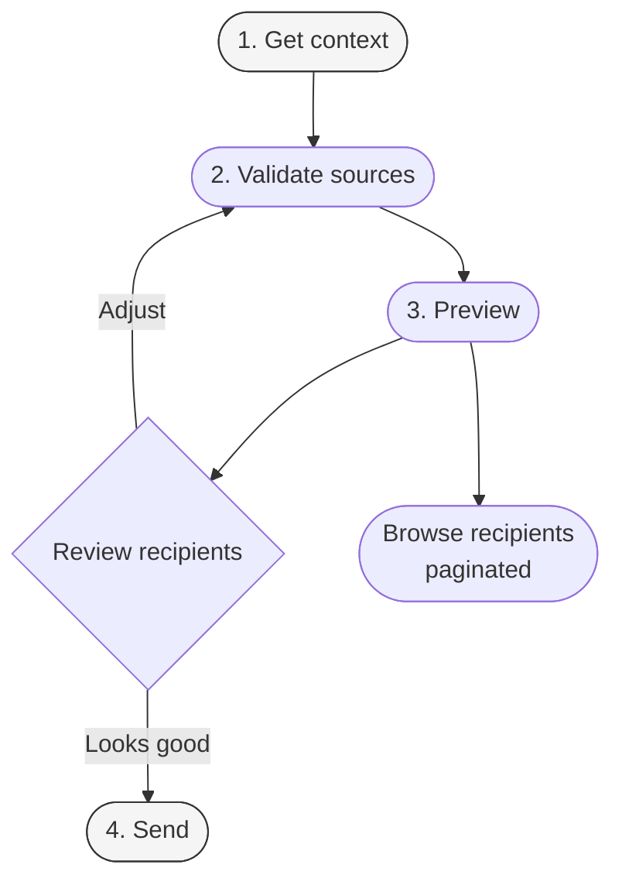

#### Summary

| Method | Endpoint | Description |
|--------|----------|-------------|
| GET | `/orgs/{platform_key}/notification-builder/context/` | Get available templates, channels, and recipient source types |
| POST | `/orgs/{platform_key}/notification-builder/validate_source/` | Validate a recipient source before previewing |
| POST | `/orgs/{platform_key}/notification-builder/preview/` | Combine sources, deduplicate recipients, create a build |
| GET | `/orgs/{platform_key}/notification-builder/{build_id}/recipients/` | Browse paginated recipients for a build |
| POST | `/orgs/{platform_key}/notification-builder/send/` | Send the notification to all recipients in a build |

---

#### GET `/orgs/{platform_key}/notification-builder/context/`

Returns the templates, channels, and recipient source types available on your platform. Call this first to populate your UI or to discover what IDs to use in subsequent requests.

**Response** `200 OK`

```json
{
  "status": "success",
  "data": {
    "templates": [
      {
        "id": "3fa85f64-5717-4562-b3fc-2c963f66afa6",
        "name": "Course Enrollment",
        "type": "USER_NOTIF_COURSE_ENROLLMENT"
      }
    ],
    "channels": [
      {"id": 1, "name": "email"},
      {"id": 2, "name": "push_notification"},
      {"id": 3, "name": "in_app"}
    ],
    "sources": [
      "email",
      "username",
      "platform",
      "csv",
      "department",
      "pathway",
      "program",
      "usergroup"
    ]
  }
}
```

```bash
curl -X GET \
  "https://your-domain.com/api/notification/v1/orgs/acme-learning/notification-builder/context/" \
  -H "Authorization: Token YOUR_ACCESS_TOKEN"
```

---

#### Recipient Source Types

You can target recipients from any combination of these sources. When you provide multiple sources in a preview request, recipients are merged and deduplicated.

| Source | `data` value | Description |
|--------|-------------|-------------|
| `email` | Comma-separated email addresses | Direct email list. Validated against Django email rules. |
| `username` | Comma-separated usernames | Platform usernames. Validated against your user records. |
| `platform` | Platform key (string) | All users on your platform. |
| `csv` | Uploaded file (multipart) | CSV file with an `email` column header. |
| `department` | Department ID (integer) | All active members of a department. |
| `pathway` | Pathway ID (string) | All suggested members of a pathway. |
| `program` | Program ID (string) | All suggested members of a program. |
| `usergroup` | User Group ID (integer) | All active members of a user group. |

---

#### POST `/orgs/{platform_key}/notification-builder/validate_source/`

Validates a single recipient source and returns the valid count, any invalid entries, and a sample of resolved recipients. Call this per source before previewing to catch errors early.

**Request body**

| Field | Type | Required | Description |
|-------|------|----------|-------------|
| `type` | string | Yes | One of the source types above |
| `data` | string | Yes (except CSV) | The source value (emails, usernames, IDs, etc.) |

For CSV sources, send as multipart form data with the file in a `file_0` field.

```bash
curl -X POST \
  "https://your-domain.com/api/notification/v1/orgs/acme-learning/notification-builder/validate_source/" \
  -H "Authorization: Token YOUR_ACCESS_TOKEN" \
  -H "Content-Type: application/json" \
  -d '{
    "type": "email",
    "data": "jane@example.com,john@example.com,invalid-address"
  }'
```

**Response** `200 OK`

```json
{
  "status": "success",
  "valid_count": 2,
  "invalid_entries": ["invalid-address"],
  "sample_recipients": [
    {"username": "jane.doe", "email": "jane@example.com"},
    {"username": "john.smith", "email": "john@example.com"}
  ]
}
```

---

#### POST `/orgs/{platform_key}/notification-builder/preview/`

Combines all your sources, deduplicates recipients, and creates a build record. Returns a `build_id` you use to browse recipients and to send.

**Request body**

| Field | Type | Required | Description |
|-------|------|----------|-------------|
| `template_id` | UUID | No | ID of an existing template. Mutually exclusive with `template_data`. |
| `template_data` | object | No | Custom content: `{"message_title": "...", "message_body": "..."}`. Mutually exclusive with `template_id`. |
| `channels` | array of integers | Yes | Channel IDs from the context endpoint |
| `sources` | array of objects | Yes | Each object: `{"type": "...", "data": "..."}` |
| `context` | object | No | Custom template variables (e.g. `{"course_name": "Python 101"}`) |
| `process_on` | ISO 8601 datetime | No | Schedule send for a future time. If omitted, sends immediately on `/send`. |

You must provide either `template_id` or `template_data`, not both. `template_data.message_body` supports template syntax (`{{ variable }}`).

```bash
curl -X POST \
  "https://your-domain.com/api/notification/v1/orgs/acme-learning/notification-builder/preview/" \
  -H "Authorization: Token YOUR_ACCESS_TOKEN" \
  -H "Content-Type: application/json" \
  -d '{
    "template_data": {
      "message_title": "Platform Maintenance Notice",
      "message_body": "Hi {{ username }}, scheduled maintenance is planned for April 20."
    },
    "channels": [1, 3],
    "sources": [
      {"type": "usergroup", "data": "12"},
      {"type": "email", "data": "external-user@example.com"}
    ],
    "context": {}
  }'
```

**Response** `200 OK`

```json
{
  "status": "success",
  "build_id": "9c1a2b3d-4e5f-6a7b-8c9d-0e1f2a3b4c5d",
  "count": 48,
  "warning": null,
  "recipients": [
    {"username": "jane.doe", "email": "jane@example.com", "status": "pending"},
    {"username": "john.smith", "email": "john@example.com", "status": "pending"}
  ]
}
```

**Response fields**

| Field | Type | Description |
|-------|------|-------------|
| `build_id` | UUID | Use this in `/recipients` and `/send` |
| `count` | integer | Total deduplicated recipients |
| `warning` | string or null | If a similar notification was sent in the last 24 hours, this describes it |
| `recipients` | array | First 10 recipients as a preview |

---

#### GET `/orgs/{platform_key}/notification-builder/{build_id}/recipients/`

Paginated list of all recipients in a build. Use this to review the full audience before sending.

**Query parameters**

| Name | Type | Required | Description |
|------|------|----------|-------------|
| `search` | string | No | Filter by username or email (case-insensitive) |
| `page` | integer | No | Page number (default: 1) |
| `page_size` | integer | No | Results per page (default: 10) |

```bash
curl -X GET \
  "https://your-domain.com/api/notification/v1/orgs/acme-learning/notification-builder/9c1a2b3d-4e5f-6a7b-8c9d-0e1f2a3b4c5d/recipients/?page=1&page_size=20" \
  -H "Authorization: Token YOUR_ACCESS_TOKEN"
```

**Response** `200 OK`

```json
{
  "count": 48,
  "next": "https://your-domain.com/...?page=2&page_size=20",
  "previous": null,
  "results": [
    {"username": "jane.doe", "email": "jane@example.com", "status": "pending"},
    {"username": "john.smith", "email": "john@example.com", "status": "pending"}
  ]
}
```

---

#### POST `/orgs/{platform_key}/notification-builder/send/`

Sends the notification to all recipients in the build. If `process_on` was set during preview and is in the future, the notification is queued for scheduled delivery.

**Request body**

| Field | Type | Required | Description |
|-------|------|----------|-------------|
| `build_id` | string (UUID) | Yes | The build ID from the preview response |

```bash
curl -X POST \
  "https://your-domain.com/api/notification/v1/orgs/acme-learning/notification-builder/send/" \
  -H "Authorization: Token YOUR_ACCESS_TOKEN" \
  -H "Content-Type: application/json" \
  -d '{"build_id": "9c1a2b3d-4e5f-6a7b-8c9d-0e1f2a3b4c5d"}'
```

**Response** `200 OK`

```json
{
  "status": "success",
  "notifications_sent": 48,
  "build_id": "9c1a2b3d-4e5f-6a7b-8c9d-0e1f2a3b4c5d",
  "message": "Notifications sent"
}
```

**Possible `message` values:**

| Message | Meaning |
|---------|---------|
| `"Notifications sent"` | Delivered immediately |
| `"Notifications queued"` | Scheduled for future delivery (`process_on` is in the future) |
| `"Similar notifications found"` | A matching notification was already sent in the last 24 hours |

#### Duplicate Detection

The system generates a SHA-256 hash from the combination of recipients, template, and channels. If an identical notification was sent in the last 24 hours, the preview response includes a `warning` and the send response returns `"Similar notifications found"` instead of sending again.

#### Build Status Lifecycle

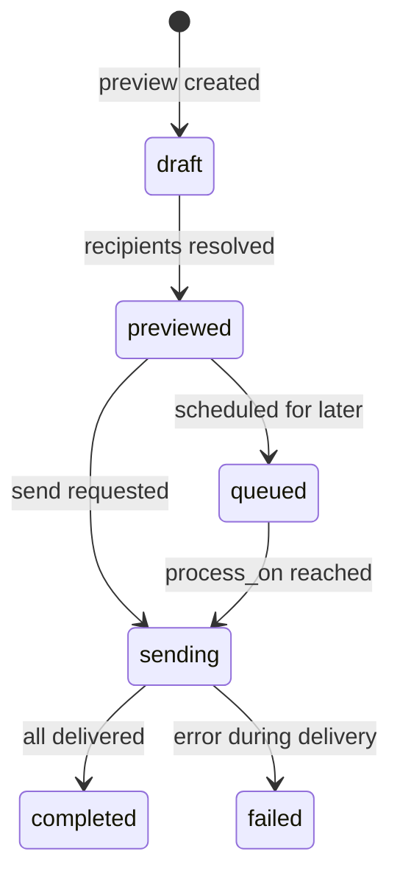

---

## 8. Template System

### 8.1 How Templates Work

Every notification type ships with a default template. You do not have your own template record for a type until you customize it. Until that point, your platform inherits the default template — reads return it with `"is_inherited": true` in the response.

The system creates your own copy the first time you edit a template via `PATCH`. The default template's content and channel settings are copied into a new record for your platform, then your edits are applied. Subsequent `PATCH` requests update your copy directly.

**Toggle state** (enabled/disabled) is a separate record from the template content. Enabling or disabling a notification type does not affect the template, and resetting a template does not affect the toggle.

**Reset** deletes your customized template. Your platform immediately reverts to inheriting the default template (`"is_inherited": true`).

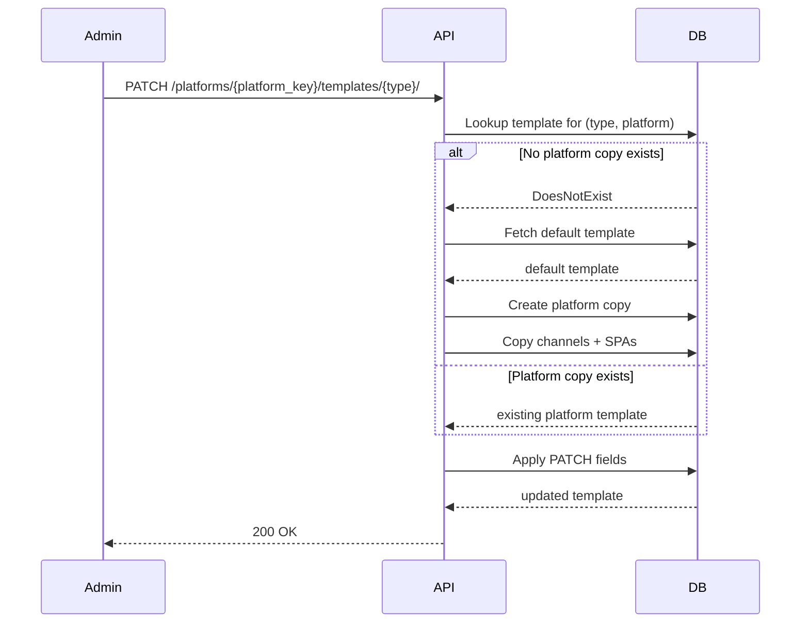

---

### 8.2 Template Variables

Templates use Django template syntax. The rendering pipeline auto-loads the `notification_template_tags` library, so its tags are available without explicit ``.

#### Global Variables (available in every template)

| Variable | Description |
|---|---|
| `site_name` | Platform name |
| `site_url` | Platform URL |
| `site_logo_url` | Platform logo URL |
| `platform_name` | Platform name (capitalized) |
| `support_email` | Platform support email |
| `privacy_url` | Privacy policy URL |
| `terms_url` | Terms of use URL |
| `logo_url` | Platform logo URL |
| `current_year` | Current year |
| `base_domain` | Base domain of the platform |
| `skills_url` | Skills platform URL |
| `unsubscribe_url` | Campaign unsubscribe URL |

#### Common User Variables

| Variable | Description |
|---|---|
| `username` | Recipient's username |
| `login_url` | Login or redirect URL |
| `login_path` | Path portion of the login URL |

#### Variables by Notification Type

**Registration**

| Type | Variable | Description |
|---|---|---|
| `APP_REGISTRATION` | `app_name` | Application name |
| `APP_REGISTRATION` | `welcome_message` | Welcome message text |
| `APP_REGISTRATION` | `benefits` | List of benefit strings |
| `APP_REGISTRATION` | `closing_message` | Closing message text |
| `USER_NOTIF_USER_REGISTRATION` | `welcome_message` | Welcome message |
| `USER_NOTIF_USER_REGISTRATION` | `next_steps` | Next-step instructions |

**Course Notifications**

| Type | Variable | Description |
|---|---|---|
| `USER_NOTIF_COURSE_ENROLLMENT` | `course_name` | Course name |
| `ADMIN_NOTIF_COURSE_ENROLLMENT` | `course_name` | Course name |
| `ADMIN_NOTIF_COURSE_ENROLLMENT` | `student_name` | Enrolled student's name |
| `ADMIN_NOTIF_COURSE_ENROLLMENT` | `student_email` | Enrolled student's email |
| `USER_NOTIF_COURSE_COMPLETION` | `course_name` | Course name |
| `USER_NOTIF_COURSE_COMPLETION` | `completion_date` | Date of completion |
| `USER_NOTIF_COURSE_COMPLETION` | `certificate_url` | Certificate URL |
| `USER_NOTIF_USER_INACTIVITY` | `days_inactive` | Days inactive |
| `USER_NOTIF_USER_INACTIVITY` | `last_activity_date` | Last activity date |

**Learner Progress**

| Type | Variable | Description |
|---|---|---|
| `USER_NOTIF_LEARNER_PROGRESS` | `courses_taken` | List of courses |
| `USER_NOTIF_LEARNER_PROGRESS` | `videos_watched_count` | Videos watched |
| `USER_NOTIF_LEARNER_PROGRESS` | `total_time_spent` | Total time spent (hours) |
| `USER_NOTIF_LEARNER_PROGRESS` | `credentials` | Credentials earned |

**Credentials**

| Type | Variable | Description |
|---|---|---|
| `USER_NOTIF_CREDENTIALS` | `item_name` | Course or program name |
| `USER_NOTIF_CREDENTIALS` | `credential_url` | Full credential URL |
| `USER_NOTIF_CREDENTIALS` | `credential_path` | Credential path |

**Invitations**

| Type | Variable | Description |
|---|---|---|
| `PLATFORM_INVITATION` | `redirect_to` | Redirect destination after signup |
| `COURSE_INVITATION` | `course_name` | Course name |
| `PROGRAM_INVITATION` | `program_name` | Program name |

**Licenses**

| Type | Variable | Description |
|---|---|---|
| `COURSE_LICENSE_ASSIGNMENT` | `course_name` | Course name |
| `PROGRAM_LICENSE_ASSIGNMENT` | `program_name` | Program name |
| `USER_LICENSE_ASSIGNMENT` | `welcome_message` | Welcome text |
| `USER_LICENSE_ASSIGNMENT` | `benefits` | Benefit list |
| `USER_LICENSE_ASSIGNMENT` | `closing_message` | Closing text |

**Role and Policy**

| Type | Variable | Description |
|---|---|---|
| `ROLE_CHANGE` | `role` | New role name |
| `ROLE_CHANGE` | `demoted` | `True` if user was demoted |
| `POLICY_ASSIGNMENT` | `role_name` | Role being assigned/removed |
| `POLICY_ASSIGNMENT` | `assigned` | `True` if assigned, `False` if removed |
| `POLICY_ASSIGNMENT` | `resources` | List of affected resources |

**Human Support**

| Type | Variable | Description |
|---|---|---|
| `HUMAN_SUPPORT_NOTIFICATION` | `ticket_subject` | Ticket subject |
| `HUMAN_SUPPORT_NOTIFICATION` | `ticket_description` | Ticket description |
| `HUMAN_SUPPORT_NOTIFICATION` | `ticket_status` | Ticket status |
| `HUMAN_SUPPORT_NOTIFICATION` | `user_name` | User who created the ticket |
| `HUMAN_SUPPORT_NOTIFICATION` | `user_email` | User's email |
| `HUMAN_SUPPORT_NOTIFICATION` | `mentor_name` | Agent name |
| `HUMAN_SUPPORT_NOTIFICATION` | `platform_key` | Platform identifier |
| `HUMAN_SUPPORT_NOTIFICATION` | `session_id` | Chat session UUID |
| `HUMAN_SUPPORT_NOTIFICATION` | `chat_link` | URL to chat transcript |
| `HUMAN_SUPPORT_NOTIFICATION` | `mentor_unique_id` | Unique identifier of the agent |
| `HUMAN_SUPPORT_NOTIFICATION` | `template_content` | Optional custom content (rendered if provided) |

**AI / Proactive Learner**

| Type | Variable | Description |
|---|---|---|
| `PROACTIVE_LEARNER_NOTIFICATION` | `student_name` | Learner's display name |
| `PROACTIVE_LEARNER_NOTIFICATION` | `student_email` | Learner's email |
| `PROACTIVE_LEARNER_NOTIFICATION` | `mentor_name` | Agent name |
| `PROACTIVE_LEARNER_NOTIFICATION` | `ai_recommendation` | AI-generated recommendation text |
| `PROACTIVE_LEARNER_NOTIFICATION` | `username` | Learner's username |
| `PROACTIVE_LEARNER_NOTIFICATION` | `platform_key` | Platform identifier |
| `PROACTIVE_LEARNER_NOTIFICATION` | `mentor_unique_id` | Unique identifier of the agent |

**Report**

| Type | Variable | Description |
|---|---|---|
| `REPORT_COMPLETED` | `report_name` | Report display name |
| `REPORT_COMPLETED` | `report_status` | `completed`, `error`, or `cancelled` |
| `REPORT_COMPLETED` | `download_url` | Download URL (completed reports only) |

#### Template Syntax

**Variable interpolation:**

```django
Hello {{ username }}, you have been enrolled in {{ course_name }}.
```

**Conditionals:**

```django

Your role has been removed.

You have been granted the {{ role }} role.

```

**Iterating lists:**

```django

- {{ benefit }}

```

**Rendering example:**

Template source:
```django
Dear {{ username }},

You have earned a credential for completing {{ item_name }}.
View your credential here: {{ credential_url }}

© {{ current_year }} {{ platform_name }}
```

Rendered output (with `username="jsmith"`, `item_name="Python Fundamentals"`, `credential_url="https://skills.example.com/credentials/abc123"`, `current_year=2026`, `platform_name="Acme Learning"`):

```
Dear jsmith,

You have earned a credential for completing Python Fundamentals.
View your credential here: https://skills.example.com/credentials/abc123

© 2026 Acme Learning
```

---

### 8.3 Customizing Templates

You can customize any editable template via `PATCH`. The first `PATCH` creates your own copy of the default; subsequent requests update that copy.

**Editable fields:** `name`, `description`, `message_title`, `message_body`, `short_message_body`, `email_subject`, `email_from_address`, `email_html_template`, `spa_ids`, `channel_ids`

For system-managed notification types (`PROACTIVE_LEARNER_NOTIFICATION`, `POLICY_ASSIGNMENT`, `HUMAN_SUPPORT_NOTIFICATION`), only configuration fields are editable — `message_body`, `short_message_body`, and `email_html_template` are read-only.

#### HTML Sanitization

The `email_html_template` field is sanitized using `bleach` before rendering.

**Allowed tags:** `a`, `abbr`, `b`, `blockquote`, `br`, `code`, `div`, `em`, `h1`–`h6`, `hr`, `i`, `img`, `li`, `ol`, `p`, `pre`, `span`, `strong`, `sub`, `sup`, `table`, `tbody`, `td`, `th`, `thead`, `tr`, `u`, `ul`, `main`, `footer`

**Allowed attributes:**
- All elements: `style`, `class`, `id`
- `<a>`: `href`, `title`, `target`
- ``: `src`, `alt`, `width`, `height`
- `<td>`, `<th>`: `colspan`, `rowspan`, `align`, `valign`

**Allowed URL protocols:** `http`, `https`, `mailto`

Elements like `<script>`, `<iframe>`, `<form>`, and `<object>` are stripped. Event handler attributes (`onclick`, `onload`) and `javascript:` URLs are removed.

#### Step-by-Step

**1. Retrieve current state:**

```bash
curl -s \
  -H "Authorization: Token YOUR_ACCESS_TOKEN" \
  "https://platform.iblai.app/api/notification/v1/platforms/acme-learning/templates/USER_NOTIF_COURSE_ENROLLMENT/"
```

If `"is_inherited": true`, the next `PATCH` will clone the default template.

**2. Apply changes:**

```bash
curl -s -X PATCH \
  -H "Authorization: Token YOUR_ACCESS_TOKEN" \
  -H "Content-Type: application/json" \
  -d '{
    "email_subject": "You have been enrolled in {{ course_name }} on {{ platform_name }}",
    "email_html_template": "<p>Hi {{ username }},</p><p>Welcome to <strong>{{ course_name }}</strong>. <a href=\"{{ login_url }}\">Go to course</a></p>"
  }' \
  "https://platform.iblai.app/api/notification/v1/platforms/acme-learning/templates/USER_NOTIF_COURSE_ENROLLMENT/"
```

A `200 OK` response returns the full template with `"is_inherited": false`.

#### Common Validation Errors

| Error | Cause |
|---|---|
| `"Template syntax error: ..."` | Invalid Django template syntax (e.g. unclosed ``) |
| `"Unauthorized template tag library(ies) loaded: 'X'..."` | `` references a disallowed library |
| `"Permission denied: ..."` | Missing `Ibl.Notifications/NotificationTemplate/write` permission |

---

### 8.4 Testing Templates

Send a test email to verify rendering and delivery. The email is sent to the requesting admin's email address.

```
POST /api/notification/v1/platforms/{platform_key}/templates/{type}/test/
```

The `context` field is optional. If omitted, defaults are injected: `username`, `site_name`, `course_name`, `platform_key`. Any keys you supply override these defaults.

```bash
curl -s -X POST \
  -H "Authorization: Token YOUR_ACCESS_TOKEN" \
  -H "Content-Type: application/json" \
  -d '{
    "context": {
      "course_name": "Advanced Python",
      "credential_url": "https://skills.example.com/credentials/test-123"
    }
  }' \
  "https://platform.iblai.app/api/notification/v1/platforms/acme-learning/templates/USER_NOTIF_CREDENTIALS/test/"
```

```json
{
  "success": true,
  "message": "Test notification sent successfully to admin@acme-learning.com",
  "recipient": "admin@acme-learning.com"
}
```

---

### 8.5 Resetting to Default

Resetting removes your customized template. Your platform immediately reverts to the default.

```
POST /api/notification/v1/platforms/{platform_key}/templates/{type}/reset/
```

No request body required.

```bash
curl -s -X POST \
  -H "Authorization: Token YOUR_ACCESS_TOKEN" \
  "https://platform.iblai.app/api/notification/v1/platforms/acme-learning/templates/USER_NOTIF_COURSE_ENROLLMENT/reset/"
```

```json
{
  "message": "Template reset to default.",
  "deleted": true
}
```

**What is preserved:** The toggle state (enabled/disabled). Other platform templates are not affected.

**What is lost:** All content edits to the platform-specific copy and any platform-specific metadata stored on the template row.

---

## 9. Special Notification Types

Three notification types have specialized behavior and configuration that differs from standard event-driven notifications. Each is controlled through the `metadata` field of the relevant `NotificationTemplate`.

---

### 9.1 Human Support Notifications

Alerts designated recipients when a learner on your platform opens a human support ticket from an AI agent session. The notification delivers ticket details and a direct link to the chat transcript.

**Requires:** AI features enabled. If not available, the callback exits without sending.

**Trigger:** Automatic when a human support ticket is created with `status == "open"`.

#### Configuration

Configure this through the template's PATCH endpoint using the fields below.

```json
{
  "human_support_recipient_mode": "platform_admins_and_mentor_owner",
  "human_support_custom_recipients": []
}
```

**`recipient_mode`** (default: `"platform_admins_and_mentor_owner"`)

| Value | Recipients |
|---|---|
| `platform_admins_and_mentor_owner` | Active platform admins and the user whose username matches the agent's creator |
| `platform_admins_only` | Active platform admins only |
| `mentor_owner_only` | The agent's creator only |
| `custom` | Resolved from the `custom_recipients` list |

**`custom_recipients`** (required when mode is `custom`)

Three target types are supported:

| `type` | Required fields | Resolution |
|---|---|---|
| `"user"` | `"id"` (integer) | User included if they have an active link for the platform |
| `"user_group"` | `"id"` (integer) | All active members of the user group |
| `"rbac_policy"` | `"policy_name"` (string) | All users assigned to the policy (direct + via groups) |

```json
[
  {"type": "user", "id": 42},
  {"type": "user_group", "id": 7},
  {"type": "rbac_policy", "policy_name": "Support Staff"}
]
```

Invalid entries are silently dropped during resolution.

#### Template Variables

| Variable | Description |
|---|---|
| `ticket_subject` | Support ticket subject line |
| `ticket_description` | Support ticket description body |
| `ticket_status` | Ticket status (will be `"open"`) |
| `user_name` | Learner's display name |
| `user_email` | Learner's email address |
| `mentor_name` | Agent display name |
| `platform_key` | Platform identifier |
| `session_id` | Chat session UUID |
| `chat_link` | URL to session transcript |

#### Recipient Resolution Flow

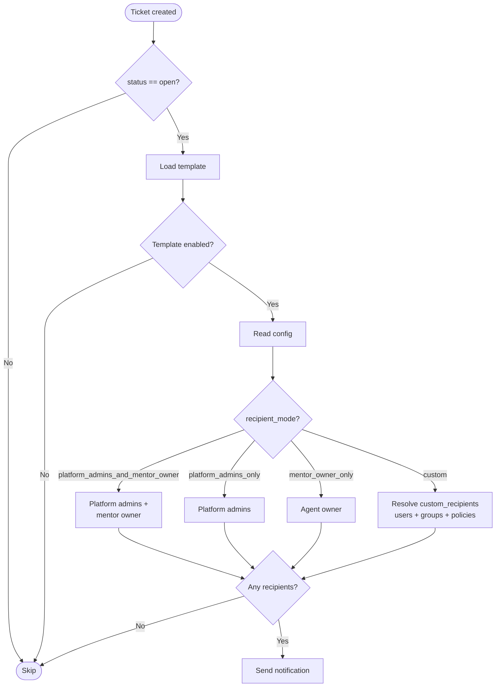

---

### 9.2 Policy Assignment Notifications

Notifies a user when an RBAC role (policy) is assigned to or removed from their account. Sent to the affected user.

**Requires:** RBAC enabled. If the template is disabled or absent, the callback exits without sending.

**Trigger:** Automatic on policy assignment or removal.

#### Configuration

Stored in `metadata` under `policy_config`.

```json
{
  "policy_notify_on_assignment": true,
  "policy_notify_on_removal": true,
  "policy_enabled_policies": []
}
```

**`notify_on_assignment`** (boolean, default: `true`) — Global toggle for assignment notifications.

**`notify_on_removal`** (boolean, default: `true`) — Global toggle for removal notifications.

**`enabled_policies`** (array, default: `[]`) — Per-role configuration.

| Field | Type | Description |
|---|---|---|
| `role_name` | string | Must match the policy role name exactly |
| `enabled` | boolean | `false` suppresses all notifications for this role |
| `notify_on_assignment` | boolean | Per-role override for assignments |
| `notify_on_removal` | boolean | Per-role override for removals |
| `subject` | string | Custom email subject (supports template variables) |

When `enabled_policies` is empty, the global flags apply to all roles. When non-empty, only explicitly listed roles can trigger notifications.

```json
{
  "policy_enabled_policies": [
    {
      "role_name": "Analytics Viewer",
      "enabled": true,
      "notify_on_assignment": true,
      "notify_on_removal": false,
      "subject": "You have been granted Analytics Viewer access"
    },
    {
      "role_name": "Agent Chat",
      "enabled": true
    }
  ]
}
```

#### Template Variables

| Variable | Description |
|---|---|
| `role_name` | Role being assigned or removed |
| `assigned` | `True` if granted, `False` if revoked |
| `resources` | List of resources the policy applies to |

---

### 9.3 Proactive Learner Notifications (AI-Powered)

Delivers AI-generated, personalized learning recommendations to learners on a recurring schedule. For each configured agent, the system retrieves a recommendation specific to the learner and sends it by email.

**Requires:** AI features enabled. If not available, the system records a failed execution and exits.

**Trigger:** Scheduled. Evaluated at the configured `execution_time` and `frequency`.

#### Configuration

Stored in `metadata` under `periodic_config`.

| Field | Type | Default | Valid Values |
|---|---|---|---|
| `frequency` | string | `"WEEKLY"` | `"DAILY"`, `"WEEKLY"`, `"MONTHLY"`, `"CUSTOM"` |
| `report_period_days` | integer | `7` | 1–365 |
| `execution_time` | string | `"09:00"` | `HH:MM` (24-hour) |
| `timezone` | string | `"UTC"` | Standard timezone names |
| `learner_scope` | string | `"ACTIVE_LEARNERS"` | `"ACTIVE_LEARNERS"`, `"ALL_LEARNERS"` |
| `agents` | array | `[]` | Agent config objects |
| `custom_interval_days` | integer | `7` | 1–365 (used when frequency is `CUSTOM`) |
| `is_active` | boolean | `false` | — |

**Frequency intervals:**

| Frequency | Interval |
|---|---|
| `DAILY` | 1 day |
| `WEEKLY` | 7 days |
| `MONTHLY` | 30 days |
| `CUSTOM` | `custom_interval_days` |

**Learner scope:**
- `ACTIVE_LEARNERS`: Learners with activity within the past `report_period_days` days.
- `ALL_LEARNERS`: All users linked to the platform.

**Agent configuration:**

```json
{
  "agents": [
    {
      "unique_id": "550e8400-e29b-41d4-a716-446655440000",
      "prompt": "Summarize {{student_name}}'s recent learning and suggest next steps.",
      "name": "Study Coach"
    }
  ]
}
```

| Field | Required | Description |
|---|---|---|
| `unique_id` | Yes | UUID of the agent |
| `prompt` | No | Custom prompt template (supports `student_name`, `student_email`, `username`, `platform_key`) |
| `name` | No | Display name (enriched from agent record if omitted) |

If `agents` is empty, all agents for the platform are used.

#### Template Variables

| Variable | Description |
|---|---|
| `student_name` | Learner's display name |
| `student_email` | Learner's email |
| `mentor_name` | Agent display name |
| `ai_recommendation` | AI-generated recommendation text |

#### Duplicate Prevention

Before sending, the system hashes the full context dictionary (including `ai_recommendation`). If a notification already exists for the student and template with an identical hash, it is skipped. Different recommendations for the same learner are both delivered; only exact duplicates are suppressed.

#### Scheduling and Delivery Flow

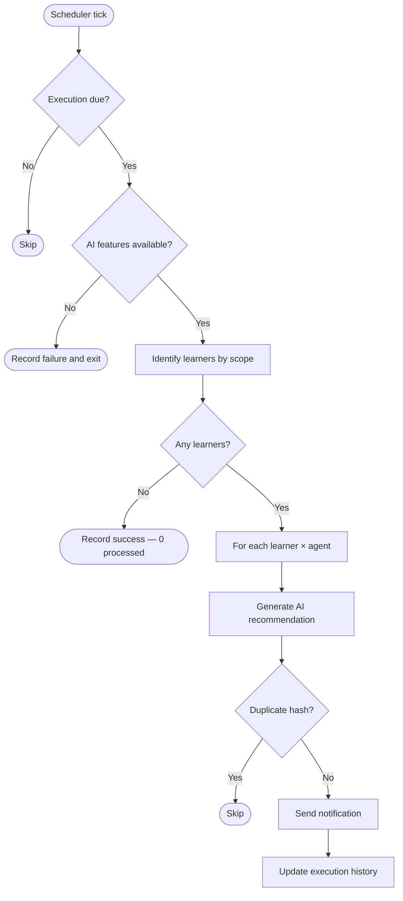

#### Execution History

After each run, the template's `periodic_config` is updated with:
- `last_execution_date`: timestamp of the completed run
- `next_execution_date`: computed as `last_execution_date + interval`
- `execution_history`: rolling log of the last 10 runs with `timestamp`, `success`, `students_processed`, and `platform_key`

---

## 10. Notification Preferences

### Platform-Level Toggles

Each notification type can be independently enabled or disabled for your platform. When disabled, no notifications of that type are sent to any user on your platform.

**Endpoint:** `PATCH /api/notification/v1/platforms/{platform_key}/templates/{type}/toggle/`

**Request body**

| Field | Type | Required | Description |
|---|---|---|---|
| `allow_notification` | boolean | Yes | `true` to enable; `false` to disable |

**Enable:**

```bash
curl -X PATCH \
  "https://platform.iblai.app/api/notification/v1/platforms/acme-learning/templates/USER_NOTIF_COURSE_ENROLLMENT/toggle/" \
  -H "Authorization: Token YOUR_ACCESS_TOKEN" \
  -H "Content-Type: application/json" \
  -d '{"allow_notification": true}'
```

**Disable:**

```bash
curl -X PATCH \
  "https://platform.iblai.app/api/notification/v1/platforms/acme-learning/templates/USER_NOTIF_COURSE_ENROLLMENT/toggle/" \
  -H "Authorization: Token YOUR_ACCESS_TOKEN" \
  -H "Content-Type: application/json" \
  -d '{"allow_notification": false}'
```

### Preference Hierarchy

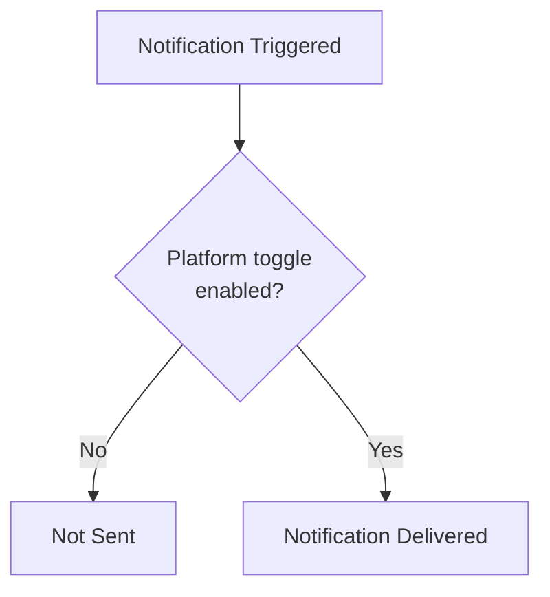

---

## 11. Platform SMTP Configuration

### Setting Up SMTP Credentials

Your SMTP credentials control how email notifications are delivered from your platform.

Required values:
- SMTP host (mail server hostname)
- SMTP port (commonly 587 for TLS, 465 for SSL)
- SMTP username
- SMTP password
- TLS/SSL mode (mutually exclusive; TLS recommended)
- From email address

### Testing SMTP Connectivity

Before activating new credentials, verify them with the test endpoint.

```
POST /api/notification/v1/platforms/{platform_key}/config/test-smtp/
```

**Request body**

| Field | Type | Required | Default | Description |
|---|---|---|---|---|
| `smtp_host` | string | Yes | — | SMTP server hostname |
| `smtp_port` | integer (1–65535) | Yes | — | SMTP server port |
| `smtp_username` | string | Yes | — | SMTP username |
| `smtp_password` | string | Yes | — | SMTP password (write-only) |
| `use_tls` | boolean | No | `true` | STARTTLS encryption |
| `use_ssl` | boolean | No | `false` | SSL/TLS on connect |
| `test_email` | email | Yes | — | Recipient for test message |
| `from_email` | email | No | — | Sender address (defaults to `smtp_username`) |

```bash
curl -X POST \
  "https://platform.iblai.app/api/notification/v1/platforms/acme-learning/config/test-smtp/" \
  -H "Authorization: Token YOUR_ACCESS_TOKEN" \
  -H "Content-Type: application/json" \
  -d '{
    "smtp_host": "smtp.gmail.com",
    "smtp_port": 587,
    "smtp_username": "notifications@example.com",
    "smtp_password": "app-specific-password",
    "use_tls": true,
    "test_email": "verify@example.com"
  }'
```

**Success:**

```json
{
  "success": true,
  "status": "success",
  "message": "Test email sent successfully to verify@example.com. Please check your inbox to confirm delivery."
}
```

**Failure — authentication:**

```json
{
  "success": false,
  "status": "error",
  "message": "SMTP test failed: Authentication failed. Please check your username and password."
}
```

**Failure — connection:**

```json
{
  "success": false,
  "status": "error",
  "message": "SMTP test failed: Connection failed. Please check your host and port settings."
}
```

---

## 12. Notification Lifecycle

Notifications have two independent state machines: delivery status and user interaction status.

### Delivery Status

| Status | Meaning |
|---|---|
| `INITIATED` | Mail delivery process started |
| `NONE` | No email delivery attempted (push-only or in-app) |
| `FAILED` | Email delivery encountered an error |

### Notification Status (User-Facing)

| Status | Meaning |
|---|---|
| `UNREAD` | Delivered but not yet read (default) |
| `READ` | Viewed or explicitly marked as read |
| `CANCELLED` | Dismissed or revoked |

### State Diagram

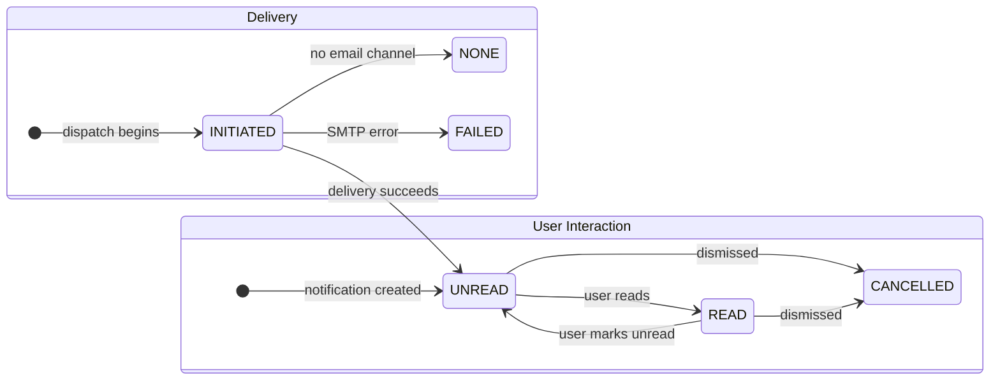

---

## 13. Error Reference

| HTTP Status | Error | Cause | Resolution |
|---|---|---|---|
| 401 | Unauthorized | Missing or invalid token | Provide a valid Token: `Authorization: Token <token>` |
| 403 | Permission Denied | Insufficient permissions | Verify the token belongs to a user with the required role or RBAC permission |
| 404 | Not Found | Resource does not exist | Check the `org`, `user_id`, `notification_id`, or template `type` in the URL |
| 400 | Bad Request | Malformed request body | Verify required fields and data types |

---

## 14. Rate Limits and Best Practices

- Use the bulk update endpoint instead of updating notifications one at a time.
- Check the unread count endpoint before fetching the full list. If count is zero, skip the list request.
- Always paginate notification list requests. Use `page` and iterate through pages.
- Test template changes using the test endpoint before enabling for all users.
- Disable notification types your platform does not use.
- Store API tokens in environment variables, not in source code or version control.
- When configuring SMTP, use `use_tls: true` with port 587. Only use `use_ssl: true` with port 465 if required. Never set both to `true`.
- Test SMTP credentials against a dedicated inbox before updating production configuration.
