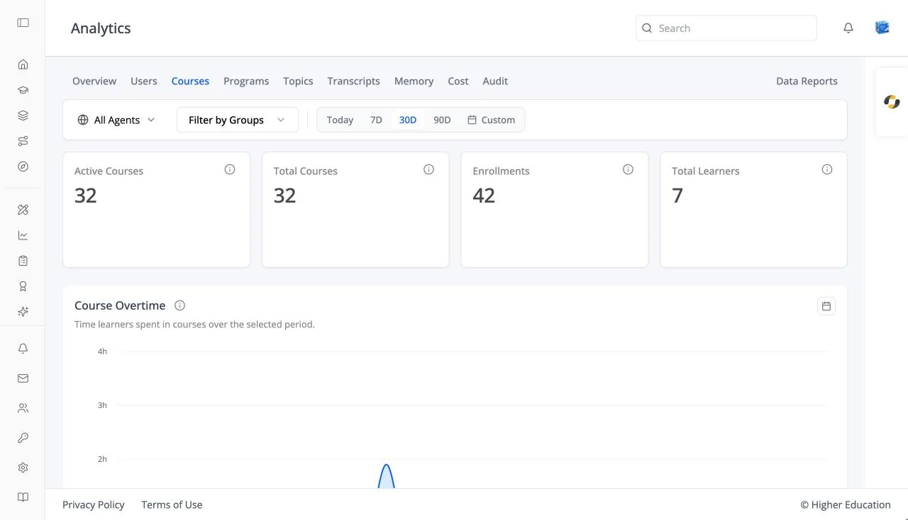

# Analytics: Courses

## Overview

The Courses tab shows enrollment across every course in the organization, and opens a detail page for each course.

## Target Audience

**Administrator** | **Analytics viewers** | **Watchers**

## Features

#### Course cards
**Active Courses**, **Total Courses**, **Enrollments**, and **Total Learners**.

#### Course Overtime
A chart of time spent in courses over the selected range.

#### Courses table
**Course Name**, **Course ID**, and **Enrollments**, searchable with "Search by course name or ID...". Click a course to open its detail page. Empty: "No courses available".

#### Course detail
**Active Enrollments** and **Completed Enrollments**, and an **Enrolled Users** table (**Name**, **Email**, **Enrollment Date**, **Last Active On**, **Progress**). Click a learner's progress icon to see their status, time spent, grades, grade summary, and completion breakdown. Course staff see the same page from the course's [Administration › Analytics](../course-administration/analytics.md).

## How to Use

#### Step 1: Find the busiest courses
Scan the **Enrollments** column of the **Courses** table, or search for a course by name or ID.

#### Step 2: Open a course
Click it to see who is enrolled and how far they have got.
