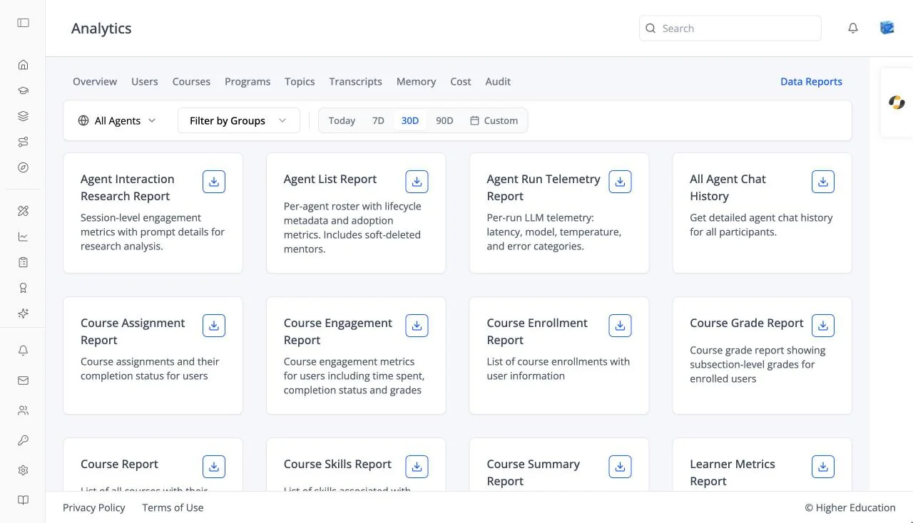

# Analytics: Data Reports

## Overview

Data Reports lets you export the organization's data as CSV files, for example user activity or chat history. It sits at the right of the analytics tab bar. See also [OS Analytics: Data Reports](../../os/analytics/data-reports.md).

## Target Audience

**Administrator** | **Analytics viewers** | **Watchers**

## Features

#### Report cards
One card per available report, each with a short description and a download button. Reports include agent reports (for example Agent Interaction Research Report, Agent List Report, All Agent Chat History) and course reports (for example Course Enrollment Report, Course Grade Report, Course Engagement Report). Choose an optional date range, then **Generate & download report**. Once a report exists, the card shows when it was generated, with **Download report** and **Regenerate report**. Empty: "No reports available yet."

#### Report links
A report download link opens a page of its own that fetches the file and downloads it automatically ("Report download started"), with "Click here to download if not started" and **Download Again**. Old links expire: "The requested report link has expired. Please generate a new report."

## How to Use

#### Step 1: Choose a report
Find the report you need and, if you want, a date range.

#### Step 2: Generate and download
Click **Generate & download report**. Use **Regenerate report** later for fresh data.
