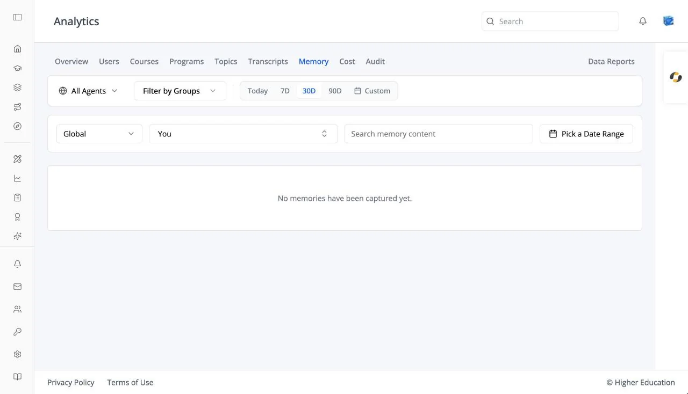

# Analytics: Memory

## Overview

The Memory tab lists what AI agents have remembered about users: facts and preferences captured from conversations, or added by hand. See also [Organization Settings: Memory](../../os/organization-settings/memory.md) for the switches that control capture.

## Target Audience

**Administrator** | **Analytics viewers** | **Watchers**

## Features

#### Scope
**This Agent** (or the agent you picked), **All Agents**, or **Global**.

#### Filters
**Search memory content**, a user filter (it starts on **You**), a date range, and **All Categories**.

#### Memories by Category
A chart of how many memories fall into each category.

#### Memory table
**User**, **Memory**, **Agent**, **Category**, and **Captured**. Click a row for **Memory Detail**, including its source: **Auto-captured** or **Added manually**. Empty: "No memories have been captured yet."

## How to Use

#### Step 1: Choose a scope
Pick one agent, all agents, or global memories.

#### Step 2: Review
Search or filter by user to check what is being remembered about someone.
