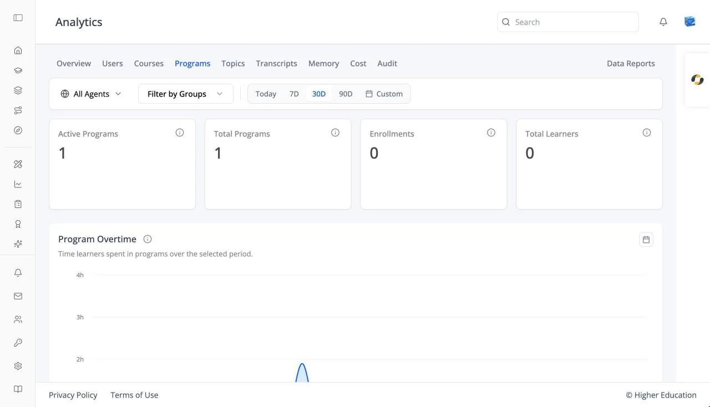

# Analytics: Programs

## Overview

The Programs tab shows enrollment across every program in the organization, and opens a detail page for each program. It works the same way as [Courses](courses.md).

## Target Audience

**Administrator** | **Analytics viewers** | **Watchers**

## Features

#### Program cards
**Active Programs**, **Total Programs**, **Enrollments**, and **Total Learners**.

#### Program Overtime
A chart of program activity over the selected range.

#### Programs table
**Program Name**, **Program ID**, and **Enrollments**. Empty: "No programs available".

#### Program detail
**Total Enrollments**, **Active Enrollments**, and **Completed Enrollments**, with an **Enrolled Users** table and per-learner progress.

## How to Use

#### Step 1: Pick a program
Click it in the **Programs** table.

#### Step 2: Check its learners
Review the enrolled users and open anyone's progress.
