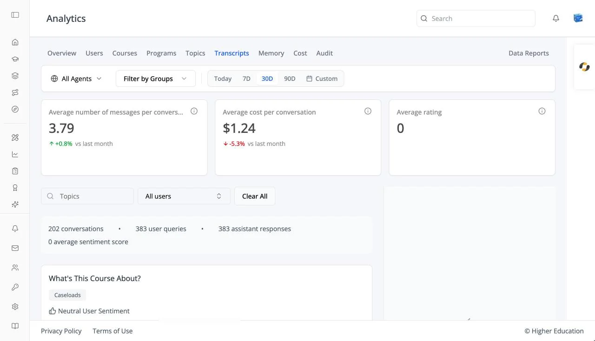

# Analytics: Transcripts

## Overview

The Transcripts tab lets you read the conversations people have had with the AI agents, including what the agent retrieved to answer them. See also [OS Analytics: Transcripts](../../os/analytics/transcripts.md), which uses the same viewer.

## Target Audience

**Administrator** | **Analytics viewers** | **Watchers**

## Features

#### Transcript cards
**Average number of messages per conversation**, **Average cost per conversation**, and **Average rating**.

#### Filters
**Topics** (choose several), a user filter (**All users** by default), and **Clear All**.

#### Summary
A line above the list totals the filtered conversations: conversations, user queries, assistant responses, and the average sentiment score.

#### Conversation list
Each conversation shows its message count, estimated cost, creation date, and sentiment (**Positive**, **Neutral**, or **Negative**), paged as "Page X of Y • N total records".

#### Conversation Transcript
Click a conversation to read it, with the agent and model named at the top. **Show Details** on a turn reveals its metadata, request context, and **Retrieved Documents**. Before you choose one: "Select a conversation to view its transcript".

## How to Use

#### Step 1: Filter
Choose a topic or user to narrow the list.

#### Step 2: Read
Click a conversation and read the transcript. Check **Retrieved Documents** when an answer looks wrong, to see what the agent was working from.
