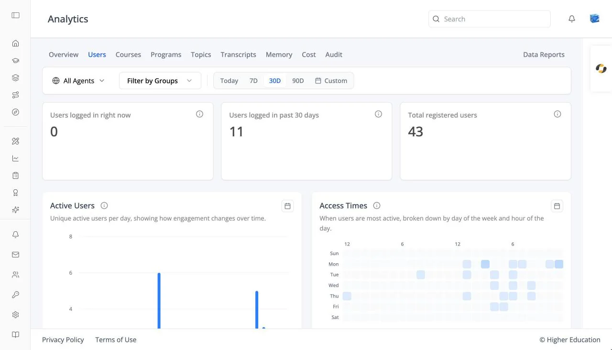

# Analytics: Users

## Overview

The Users tab shows who is using the LMS and its agents, and when.

## Target Audience

**Administrator** | **Analytics viewers**

## Features

#### User cards
**Users logged in right now**, **Users logged in past 30 days**, and **Total registered users**.

#### Active Users
A chart of active users per day over the selected range.

#### Access Times
A heatmap of the days and hours people are most active, from "Less active" to "More active".

#### User Details
A table with **User Email**, **Username**, **Messages**, and **Last Active**. Search with "Search by email or username...". Click a user to open their profile.

## How to Use

#### Step 1: Check activity
Compare users active now, in the past 30 days, and in total.

#### Step 2: Plan around peak times
Use **Access Times** to schedule announcements and live sessions when people are online.

#### Step 3: Find a person
Search **User Details** to see how active one user has been.
