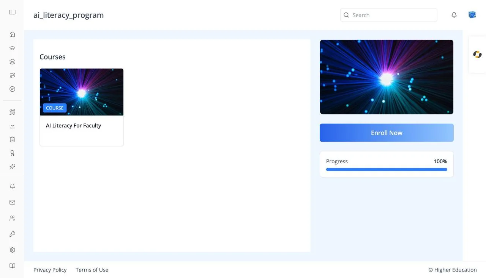

# Programs

## Overview

A program is a set of courses grouped into one structured offering, with its own enrollment and overall progress. The program page lists the program's courses and lets you enroll in the whole program at once. The program's name appears in the top bar.

Open a program from a **PROGRAM** card on [Discover](discover.md), or click **Programs** in the left rail to see the programs you are enrolled in.

Administrators of the organization that owns the program see extra tabs on the same page for editing it.

## Target Audience

**Learner** | **Administrator** (the About and Settings tabs)

## Features

#### Courses
A grid of the program's course cards. Click a card to open its [course page](course-about.md). With no courses, the page reads "No courses found under this program."

#### Sidebar
The program's card image, then:

- **Enroll Now** (or **Purchase Now** when the organization sells access). Hidden once you are enrolled.
- **Progress**: a bar showing how much of the program you have completed.
- An information card with the price, language, start date, and credential, where set.

#### About tab (administrators)
The **Program Description**, or "No description available."

#### Settings tab (administrators)
A form for editing the program, saved with **Save Settings**:

- **Basic Information**: Subject, URL Slug, Level, Language, Description, Tags, and Topics. Type a tag or topic and press Enter to add it.
- **Pricing & Dates**: Display Price, Start Date, End Date, Enrollment Start, and Enrollment End. End dates must come after their start dates.
- **Visibility & Access**: Catalog Visibility (Both, About, or None), Invitation Only, and Credential.
- **Images**: Banner Image URL and Card Image URL, with a preview. A bad link shows "Invalid image URL".
- **Social & Promotion**: Promotion, Social Team, and Social Channels.

## How to Use

#### Step 1: Review the courses
Look through the program's courses and open any of them to read more.

#### Step 2: Enroll
Click **Enroll Now** in the sidebar. You will see "Enrolled into program successfully".

#### Step 3: Track your progress
Return to the program page, or click **Programs** in the left rail, to see your progress bar move as you complete its courses.
