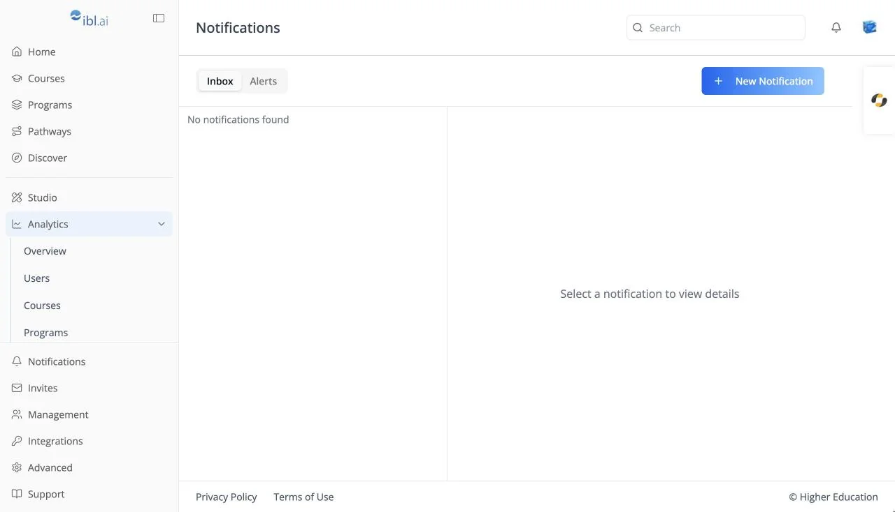

# Common Components

## Overview

Many LMS screens are not unique to the LMS. They are shared components from ibl.ai's common component library (`@iblai/iblai-js`) and appear the same way across ibl.ai applications, including [OS](../../os/overview.md). When a shared component improves, every application picks up the change.

## Target Audience

**Learner** | **Administrator** | **Developer**

## Shared Components in the LMS

#### Top bar and sidebar
The top bar's search, notification bell, and avatar menu, and the left rail's footer tools. Documented in [Navigating the LMS](../getting-started/navigation.md).

#### Profile dialog
Basic, Overview, Social, Gradebook, Education, Experience, Purchases, Memory, History, Usage, Privacy, and Security. Documented in [Profile Dialog](../profile/profile-dialog.md), with the shared tabs in [OS Profile](../../os/profile/basic.md).

#### Notification center
The bell dropdown, the inbox, and alerts. Documented under [Notifications](../notifications/inbox.md).

#### Analytics dashboards
Every analytics tab, including the course and program detail pages. Documented under [Analytics](../analytics/overview.md).

#### Organization settings
Invites, Management, Integrations, Monetization, Billing, Memory, Virtual Machine, and Advanced. Documented under [Organization Settings](../organization-settings/overview.md).

#### AI agent chat
The chat on a course's [Agent tab](../course/agent.md) and in the [AI agent tab](../getting-started/navigation.md#ai-agent-tab) on the right edge is the ibl.ai agent chat, the same one as the [OS chat interface](../../os/chat-canvas/chat.md).

## Related Resources

#### Source Repositories
The LMS lives at [github.com/iblai/lms](https://github.com/iblai/lms). Companion tooling lives in [github.com/iblai/vibe](https://github.com/iblai/vibe).
