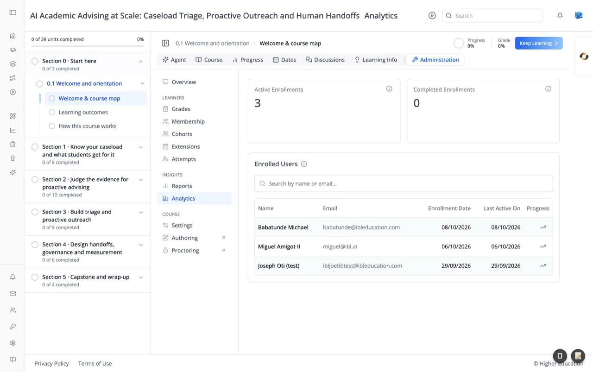

# Course Administration: Analytics

## Overview

Analytics shows how learners are doing in this course: how many are enrolled, how many have finished, and each learner's progress. It is the same view as the course detail page in the organization's [Courses analytics](../analytics/courses.md), opened from inside the course.

## Target Audience

**Course staff** | **Administrator** | **Analytics viewers**

## Features

#### Active Enrollments
"Learners enrolled in this course who have not finished it yet."

#### Completed Enrollments
"Learners who have finished every requirement of this course."

#### Enrolled Users
A table of everyone enrolled, with **Name**, **Email**, **Enrollment Date**, **Last Active On**, and **Progress**. Search with "Search by name or email...". With no learners it reads "No enrollments available".

#### Learner progress
Click the trend icon in a learner's **Progress** column to open their progress: status, pass date, time spent, enrollment date, grades, a grade summary by assignment type, and a completion breakdown.

## How to Use

#### Step 1: Check the totals
Compare active and completed enrollments.

#### Step 2: Find a learner
Search by name or email, and check **Last Active On** to spot learners who have stopped.

#### Step 3: Look closer
Click a learner's progress icon to see where they are and how they are scoring.
