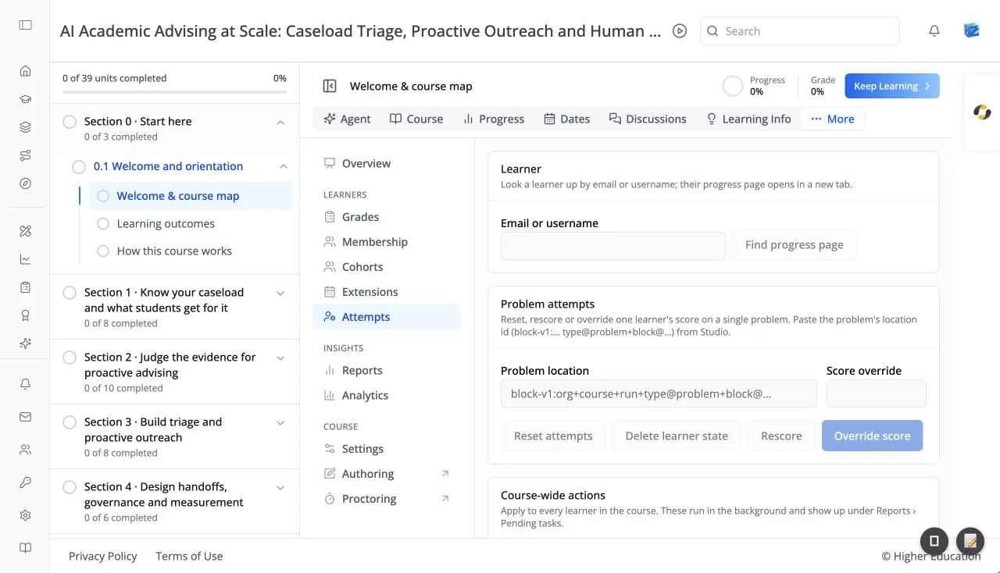

# Course Administration: Attempts

## Overview

Attempts lets you fix problems with a learner's work on a problem: give them their attempts back, clear their answers, rescore, or set a score by hand. You can act for one learner or for everyone in the course.

Problems are identified by their location id, which you copy from Studio. It looks like `block-v1:… type@problem+block@…`.

## Target Audience

**Course staff** | **Administrator**

## Features

#### Learner
Enter an **Email or username** and click **Find progress page**. An **Open progress page ↗** link appears that opens that learner's [progress](../course/progress.md) in a new tab.

#### Problem attempts
"Reset, rescore or override one learner's score on a single problem." Enter the **Problem location**, then:

- **Reset attempts**: gives the learner their attempts back, keeping their answers.
- **Delete learner state**: wipes the learner's answers so the problem starts fresh.
- **Rescore**: grades the learner's existing answers again.
- **Override score**: sets the score you enter in **Score override**.

#### Course-wide actions
"Apply to every learner in the course." **Reset attempts for all learners** and **Rescore for all learners** act on one problem for everyone. You are asked to confirm ("… on this problem for every learner?") with **Yes, continue** or **Cancel**. These run in the background and appear under [Reports](reports.md) › Pending tasks.

## How to Use

#### Step 1: Find the problem
In Studio, copy the problem's location id.

#### Step 2: Fix one learner
Enter the learner and the problem location, then click the action you need, for example **Reset attempts** when a learner ran out of tries.

#### Step 3: Fix everyone
If a problem was set up wrongly, correct it in Studio, then use **Rescore for all learners**.
