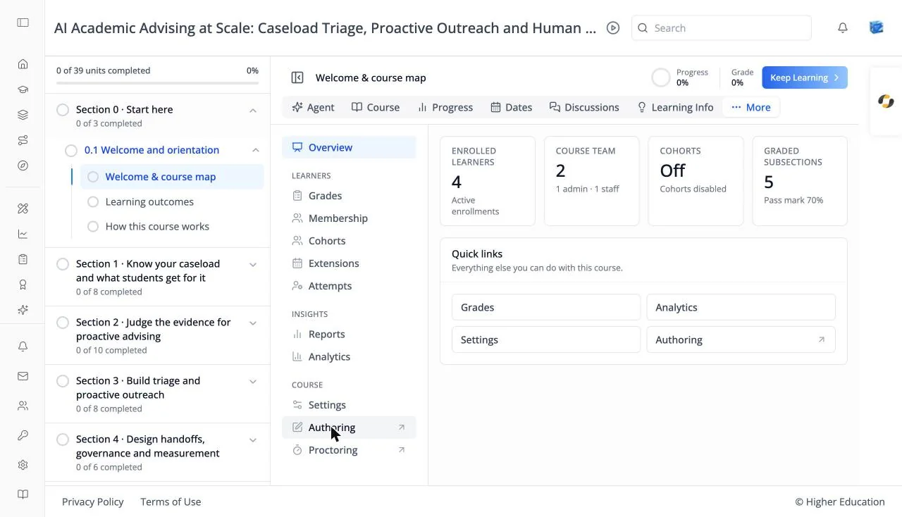

# Course Administration: Authoring and Proctoring

## Overview

The last two items in the Administration navigation, **Authoring ↗** and **Proctoring ↗**, open tools outside the LMS in a new browser tab.

## Target Audience

**Course staff** | **Administrator**

## Features

#### Authoring
Opens this course in **Studio**, the course editor, where you build sections, subsections, and units, add problems and AI assessments, and publish changes. Course **Admin** and **Staff** roles and platform administrators see it; limited staff do not. The [Overview](overview.md) quick links and the **Studio** icon in the left rail lead to Studio too.

#### Proctoring
Opens the course's special exams page in the instructor dashboard, where you manage timed and proctored exams: review exam attempts, give learners extra time, and handle allowances.

## How to Use

#### Step 1: Edit the course
Click **Authoring ↗**, make your changes in Studio, and publish them. They appear in the course player straight away.

#### Step 2: Manage exams
Click **Proctoring ↗** to look after timed exams and exam allowances.
