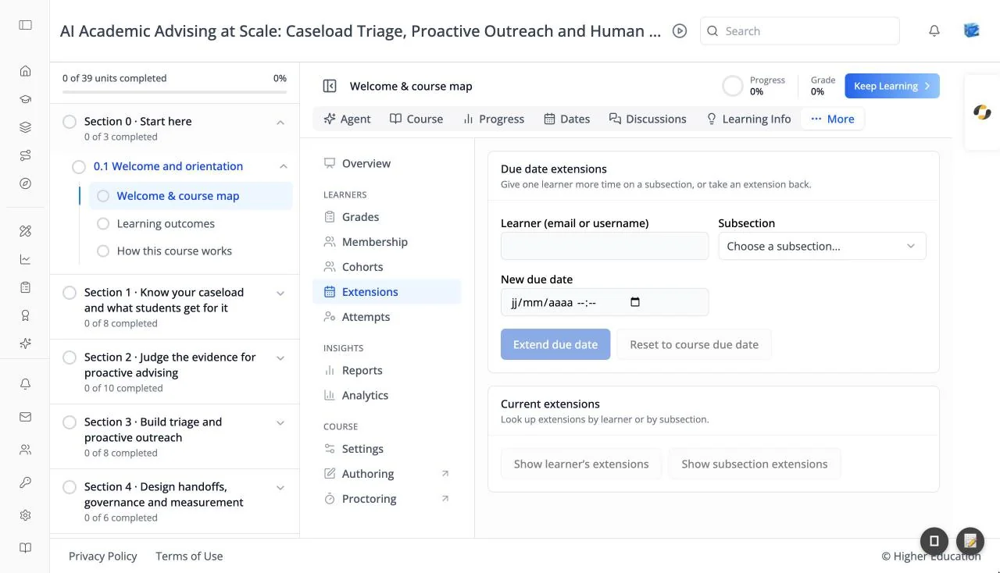

# Course Administration: Extensions

## Overview

Extensions give one learner more time on one subsection without changing the due date for everyone else. "Give one learner more time on a subsection, or take an extension back."

## Target Audience

**Course staff** | **Administrator**

## Features

#### Due date extensions
- **Learner (email or username)**.
- **Subsection**: chosen from the course's graded subsections.
- **New due date**: a date and time.

Click **Extend due date** to give the extension, or **Reset to course due date** to take it back.

#### Current extensions
"Look up extensions by learner or by subsection." Click **Show learner's extensions** to list every extension one learner has, or **Show subsection extensions** to list everyone with an extension on one subsection. With none, it reads "No extensions."

## How to Use

#### Step 1: Give an extension
Enter the learner, choose the subsection, pick the new due date, and click **Extend due date**. The learner sees the new date on their [Dates tab](../course/dates.md).

#### Step 2: Review extensions
Use **Show subsection extensions** before a deadline to see who has extra time.

#### Step 3: Take one back
Enter the learner and subsection and click **Reset to course due date**.
