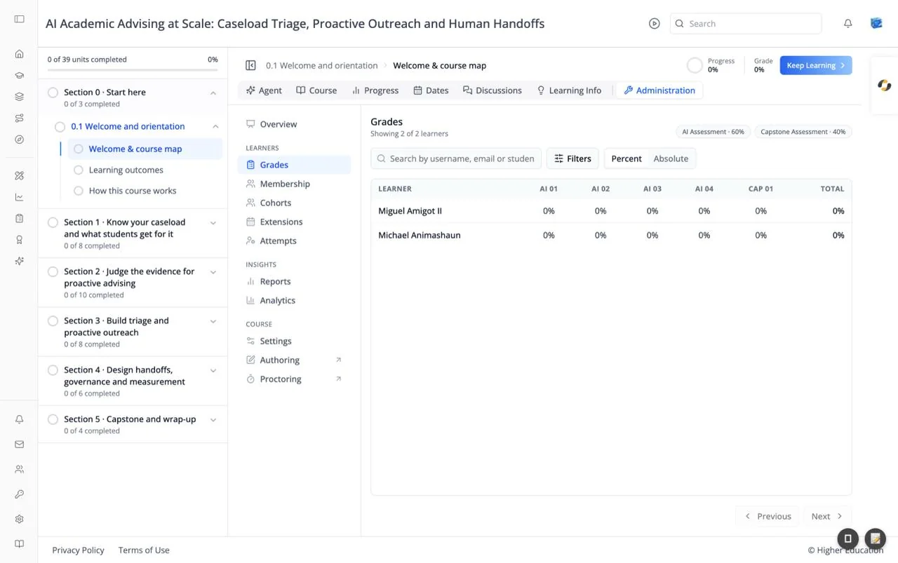

# Course Administration: Grades

## Overview

Grades is the course gradebook: every learner's score on every graded subsection, plus their total. From here you can search and filter learners and override an individual score.

The heading shows how many learners are listed, for example "Showing 2 of 2 learners". Chips at the right show the course's grading policy, for example "AI Assessment · 60%" and "Capstone Assessment · 40%".

## Target Audience

**Course staff** | **Administrator**

## Features

#### Search
"Search by username, email or student key" narrows the table as you type.

#### Filters
Opens a panel of filters, applied with **Apply filters** and reset with **Clear**:

- **Assignments**: Assignment type, Assignment, and Assignment grade (minimum and maximum %). Pick an assignment before filtering by its grade.
- **Overall grade**: minimum and maximum %.
- **Learner groups**: Track, Cohort, and **Include course team members**.

Percentages must be between 0 and 100, and the minimum can't be above the maximum. Each active filter appears as a removable chip under the toolbar, with **Clear all**. The **Filters** button shows how many are active.

#### Percent / Absolute
**Percent** shows each score as a percentage (for example "85%"); **Absolute** shows points earned out of points possible.

#### Gradebook table
One row per learner, with their name and email, a column per graded subsection (short labels such as "AI 01" or "CAP 01"), and **Total**, the overall grade with its letter grade. A dash means no score yet. The table shows 25 learners per page, with **Previous** and **Next**. If no one matches, it reads "No learners match these filters."

#### Override grade
Click a score to open **Override grade** for that learner and subsection. It shows the **Current score** and the **Original (before overrides)** score, and a **History** of earlier overrides. Enter a **New score (out of N)** and an optional **Reason** ("Visible in the override history"), then click **Save override**. A message confirms "Grade updated for {learner}".

#### Frozen grades
When the course's grades are frozen, a "Grades are frozen" pill appears and scores can't be changed.

## How to Use

#### Step 1: Find learners
Search for a learner, or use **Filters**, for example everyone below 50% overall.

#### Step 2: Switch views
Toggle **Percent** and **Absolute** to see scores the way you need them.

#### Step 3: Override a score
Click the score, enter the new value and a reason, and click **Save override**.

#### Step 4: Export
To download every learner's grades, generate a **Grade report** under [Reports](reports.md).
