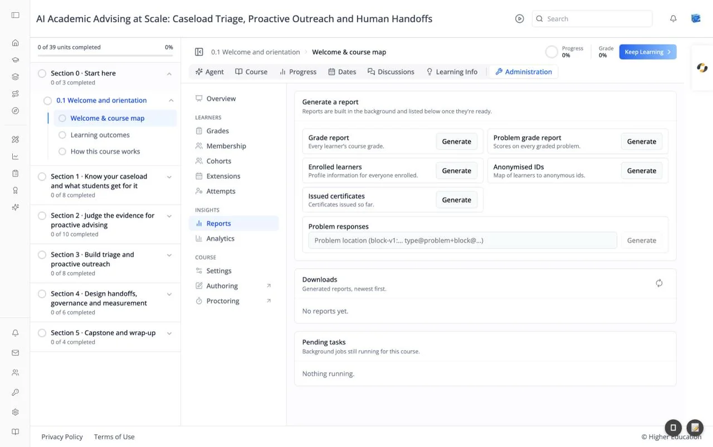

# Course Administration: Reports

## Overview

Reports builds downloadable files of the course's data: grades, enrollments, certificates, and learner answers. "Reports are built in the background and listed below once they're ready."

## Target Audience

**Course staff** | **Administrator**

## Features

#### Generate a report
Click **Generate** beside the report you need:

| Report | Contains |
|---|---|
| **Grade report** | "Every learner's course grade." |
| **Problem grade report** | "Scores on every graded problem." |
| **Enrolled learners** | "Profile information for everyone enrolled." |
| **Anonymised IDs** | "Map of learners to anonymous ids." |
| **Issued certificates** | "Certificates issued so far." |
| **Problem responses** | Every learner's answers to one problem. Enter its **Problem location** first |

A message confirms "{report} queued — it appears under Downloads when ready."

#### Downloads
"Generated reports, newest first." Each finished file has a **Download** link. Click the refresh icon to check for new ones. Empty: "No reports yet."

#### Pending tasks
"Background jobs still running for this course.": each with **Task**, **Requested by**, **Started**, and **Status**. Course-wide actions from [Attempts](attempts.md) appear here too. Empty: "Nothing running."

## How to Use

#### Step 1: Generate
Click **Generate** on the report you need.

#### Step 2: Wait
Watch **Pending tasks**. Larger courses take longer.

#### Step 3: Download
Click the refresh icon on **Downloads**, then **Download** on your file.
