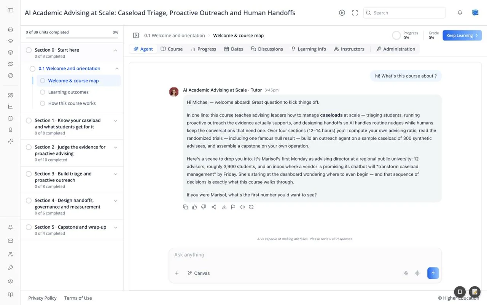
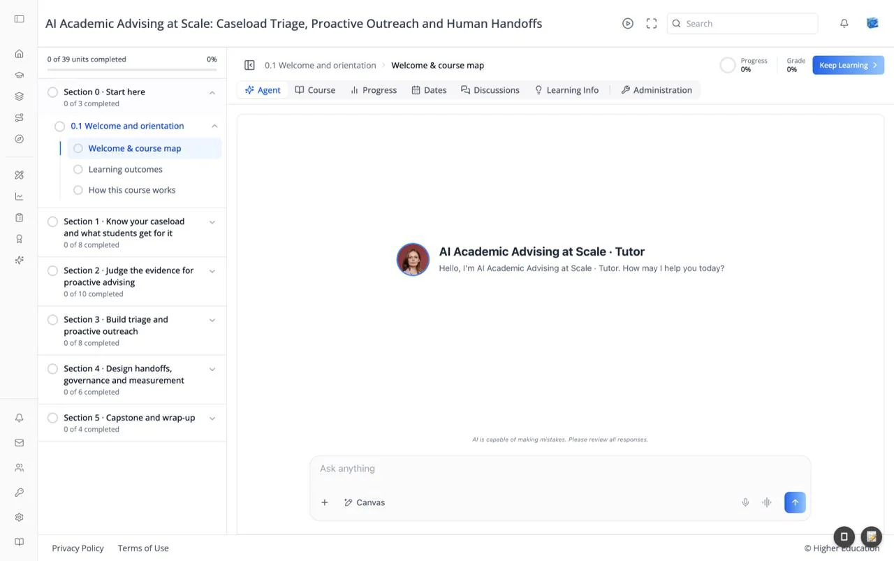

# Course: Agent Tab

## Overview

The Agent tab puts an AI tutor at the center of the course. Instead of reading a unit, you learn by talking with an agent that knows the course and the unit you are on. It teaches, asks you questions, and follows up on your answers.

The tab fills the content area with the chat. When it first opens, the agent greets you by name, for example "Hello, I'm AI Academic Advising at Scale · Tutor. How may I help you today?" The current unit loads quietly in the background so the agent can work from it, and a "Loading course…" spinner shows until it is ready.

The Agent tab appears on agent-led courses; in those courses **Access Course** opens it directly. Courses choose which agent to use; if a course does not set one, the organization's default agent is used.

## Target Audience

**Learner**

## Features

#### Conversation
Your messages appear on the right; the tutor's responses appear on the left with its avatar, name, and the time. Responses render formatted text, including bold terms and lists. When the agent reasons before answering, a collapsible **Thought** line appears above its reply.

#### Following the course
The agent always knows which unit you are on. When you move to another unit, with **Keep Learning** or the outline, a notice reads `Switched to "<unit>"` and the agent picks up from there.

#### Message actions
Under each response: copy, thumbs up, thumbs down, share, download, report, read aloud, and retry. They work the same way as in the [OS chat interface](../../os/chat-canvas/chat.md#message-actions).

#### Composer
The **Ask anything** box at the bottom, with **+** to attach files, the **Canvas** tool, a microphone for voice input, the voice-call button, and send. A disclaimer above it reads "AI is capable of making mistakes. Please review all responses."

#### New chat
The speech-bubble-and-plus icon in the top bar starts a fresh conversation with the agent.

#### Autoplay
The play icon in the top bar turns on autoplay, so the agent reads each new response aloud ("Autoplay turned on"). It appears only when both the course and the organization have voice autoplay enabled, and starts off each time you load the page.

#### Fullscreen
The expand icon in the top bar makes the agent fill the screen. Click the round button at the top right to exit, or leave the tab.

#### Media
When the current unit contains PDFs, videos, or other media, a **Media** button in the top bar lists them. Choose one to preview it without leaving the chat.

#### Learn / Assess switch
On units that include an AI assessment, a **Learn** / **Assess** switch appears in the top bar. **Learn** keeps the conversational tutor; **Assess** replaces the chat with the unit's own assessment so you can be quizzed on what you covered. The first time you see it, a hint titled "Two ways to learn" explains the switch.

#### Unit completion
In some courses the agent, rather than simply opening a unit, decides when you have completed it. The outline and your progress update when it does.

## How to Use

#### Step 1: Open the unit
Pick a unit from the outline. The agent loads it and greets you.

#### Step 2: Learn by conversation
Ask what the unit is about, or answer the agent's questions. Expect it to ask you to reason things through rather than just giving you the answer.

#### Step 3: Ask for help
If a question is unclear, say so ("Can you rephrase your question?") and the agent will try again.

#### Step 4: Move on
Click **Keep Learning** when you are ready for the next unit. The agent follows you there.
