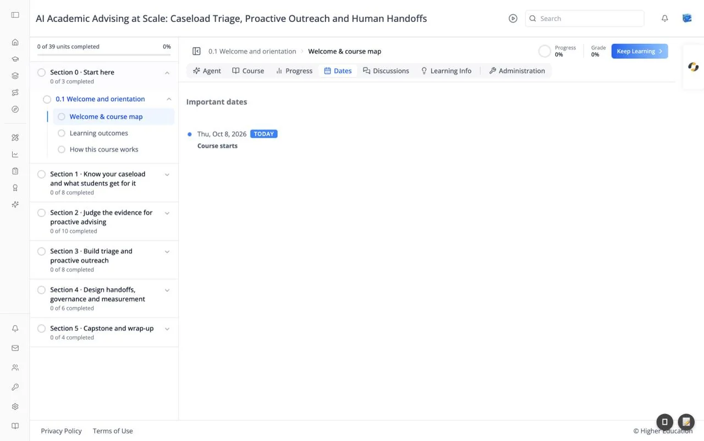

# Course: Dates Tab

## Overview

The Dates tab, headed "Important dates", is a timeline of the course's key dates: when it starts, when assignments are due, and when it ends. Today's date is marked with a **TODAY** badge so you can see what is coming up.

## Target Audience

**Learner**

## Features

#### Timeline
Each entry shows the date (for example "Thu, Oct 8, 2026") and what happens then (for example "Course starts"). Due dates for graded work appear here too.

## How to Use

#### Step 1: Plan ahead
Check the tab at the start of the course and note each due date.

#### Step 2: Check your extensions
If the course team has given you more time on an assignment, your new due date shows here. See [Extensions](../course-administration/extensions.md).
