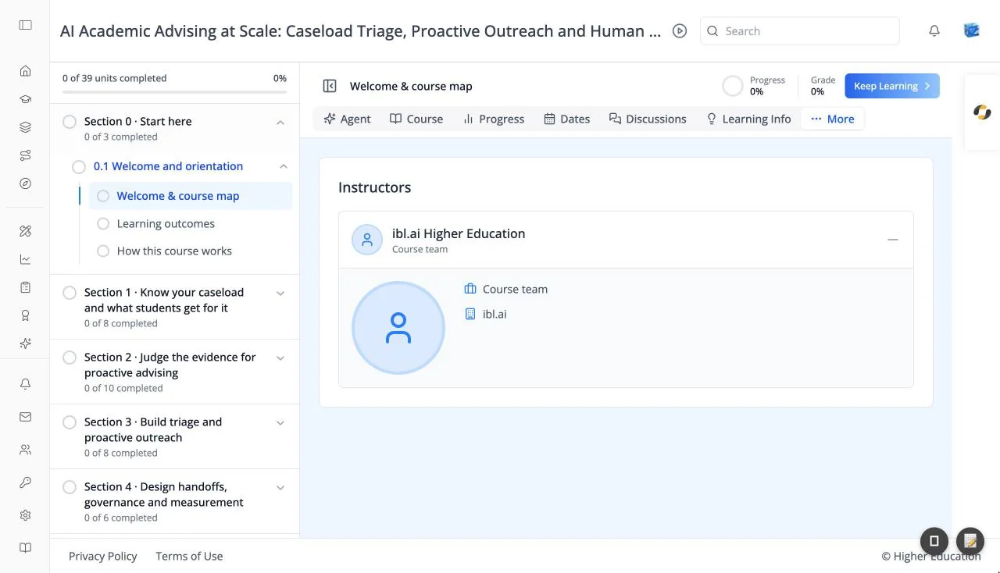

# Course: Instructors Tab

## Overview

The Instructors tab introduces the people who teach the course. A card titled **Instructors** lists each instructor with their photo (or a placeholder), name, and title.

The tab appears only for courses that list their instructors. Everyone in the course can see it.

## Target Audience

**Learner**

## Features

#### Instructor details
Click **+** beside an instructor to expand their entry and see a larger photo, their title, their organization, and an **About** biography. Click **−** to collapse it again.

## How to Use

#### Step 1: Meet the instructors
Open the tab and expand an instructor to read their background.
