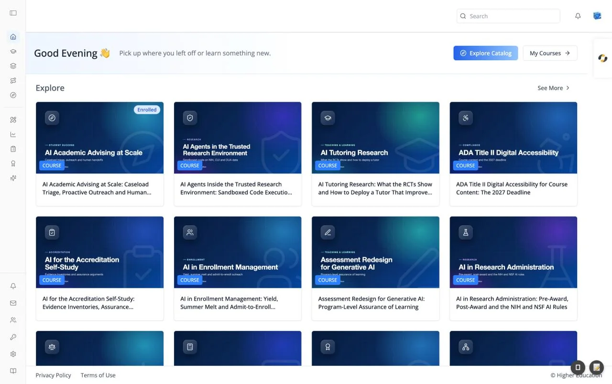

# Navigating the LMS

## Overview

Every screen in the LMS shares the same frame: an icon rail on the left, a top bar with search, notifications, and your avatar, an AI agent tab on the right edge, and a footer at the bottom. This page explains each part of that frame so the screen-by-screen pages can focus on what is unique to them.

The left rail starts collapsed to icons. Hover an icon to see its label, or click the panel icon at the very top to expand the rail into a full sidebar with labels next to each icon and your organization's logo. On a phone the rail is hidden; tap the menu button in the top bar to open it as a slide-out sheet.

The frame appears once you are signed in. The [Start screen](start-screen.md) is the only page that runs full-screen without it.

## Target Audience

**Learner** | **Administrator** (Studio, Analytics, and most of the sidebar footer depend on your role)

## Features

#### Left rail: learning
The top group of icons takes you to your learning:

| Icon | Label | Goes to |
|---|---|---|
| House | **Home** | The [Home page](../catalog/home.md) |
| Graduation cap | **Courses** | Your enrolled courses, on the [Discover page](../catalog/discover.md) filtered to Courses and Enrolled |
| Layers | **Programs** | Your enrolled programs, on Discover filtered to Programs and Enrolled |
| Route | **Pathways** | Your enrolled pathways, on Discover filtered to Pathways and Enrolled |
| Compass | **Discover** | The full catalog. Hidden when your organization has turned the Discover page off |

#### Left rail: tools
Below a divider sit the tools:

| Icon | Label | What it does | Who sees it |
|---|---|---|---|
| Pencil and ruler | **Studio** | Opens the course authoring tool (Studio) in a new browser tab | Platform and department administrators |
| Line chart | **Analytics** | Expands into the analytics menu: Overview, Users, Courses, Programs, Topics, Transcripts, Memory, Costs, Audit, and Data Reports. See [Analytics](../analytics/overview.md) | Users with analytics access, and watchers (watchers see a shorter list) |
| Clipboard | **Gradebook** | Opens the Gradebook dialog: "Your grades and progress across courses, programs, and pathways." See [Gradebook](../profile/gradebook.md) | Everyone |
| Award ribbon | **Credentials** | Opens the Credentials dialog: "Credentials you have earned." See [Credentials](../profile/credentials.md) | Everyone |
| Sparkles | **Skills** | Opens the Skills dialog: "Your earned, self-reported, and desired skills." See [Skills](../profile/skills.md) | Everyone |

In the collapsed rail, clicking the Analytics icon expands the sidebar and opens the analytics menu.

#### Left rail: footer
The bottom cluster holds notifications and organization tools:

| Icon | Label | What it does | Who sees it |
|---|---|---|---|
| Bell | **Notifications** | Opens the [notification inbox](../notifications/inbox.md) | Everyone |
| Envelope | **Invites** | Opens the Invite User dialog | Administrators with invite permission |
| People | **Management** | Opens Management: "Manage users and their permissions in the system." | Administrators, and users granted a management permission |
| Key | **Integrations** | Opens Integrations: "Manage your integrations with other services." | Administrators |
| Coins | **Monetization** | Opens Monetization: "Configure paywalls, pricing, and revenue." | Administrators with selling permission, when monetization is on |
| Gear | **Advanced** | Opens Advanced: "Configure advanced organization settings." | Administrators |
| Book | **Support** | Opens the ibl.ai documentation in a new tab | Everyone |

The footer tools are covered in [Organization Settings](../organization-settings/overview.md).

#### Page title
The left side of the top bar names where you are: the course title inside a course, the program or pathway name on those pages, and "Explore Content", "Notifications", or "Analytics" on those screens. Your organization can also add its own links here.

#### Search
The **Search** box searches the whole catalog of courses, programs, and pathways by keyword. Press Enter to open the results on the [Discover page](../catalog/discover.md); on Discover itself, the search updates the results in place. The box appears on tablets and larger screens, and only when the Discover page is enabled.

#### Notification bell
The bell shows a red badge with your unread count (capped at "99+"). Clicking it opens a dropdown of recent notifications, each with its title and how long ago it arrived. Click one to open it and mark it read, click **Mark all as read** to clear the badge, or click **View all** to go to the [inbox](../notifications/inbox.md).

#### Avatar menu
Your avatar (your uploaded photo, a Gravatar, or your initials) opens a menu with:

- **Profile**: opens the [profile dialog](../profile/profile-dialog.md) on its Basic tab.
- **Organization switcher**: shows the current organization and lets you switch to another one you belong to. It appears when you are an administrator or belong to more than one organization. Clicking the organization name opens its [organization settings](../organization-settings/overview.md) if you manage it.
- **Log Out**.

Visitors who are not signed in see **Log in** and **Sign up for free** instead.

#### AI agent tab
A small white tab on the right edge of the screen, showing the agent's picture, opens a chat panel with an AI agent beside whatever page you are on ("Open chat assistant"). On a phone it is a round floating button at the bottom right that opens the chat full-screen.

Inside a course, the tab opens that course's own agent. Elsewhere it opens your organization's default agent, falling back to the agent you used most recently. The tab is hidden on a course's [Agent tab](../course/agent.md), which already shows the agent full-size, and on courses whose agent is set to hidden. You can turn it off for yourself with the **Display Agent Sidebar** switch on your [profile](../profile/profile-dialog.md).

#### Footer
The footer carries your organization's links, typically **Privacy Policy** and **Terms of Use**, and a copyright line with the organization's name (for example "© Higher Education").

#### First-visit product tour
The first time you sign in, a short guided tour points out the main controls. Each step dims the screen and puts a tooltip beside one element, with **Next**, **Back**, an `n of N` counter, **Skip tour**, and a close button.

| # | Step | Points at | Shown when |
|---|---|---|---|
| 1 | Your profile | The avatar menu | Always |
| 2 | Search | The search box | Discover is enabled |
| 3 | Discover | The Discover icon | Discover is enabled |
| 4 | Manage your organization (administrators) or Management (watchers) | The sidebar footer tools | You are an administrator or a watcher |

Finishing or skipping both count as seen, and the result is saved to your account, so the tour does not return on another device. Press `Esc` to skip; clicking the dimmed background does nothing. Add `?tour=1` to the page's URL to replay it. The tour does not run on phones, inside courses, during onboarding, or on the Start screen.

## How to Use

#### Step 1: Find your learning
Click **Home** for a starting point, or **Courses**, **Programs**, or **Pathways** to jump straight to what you are enrolled in.

#### Step 2: Look for something new
Type a keyword into **Search** and press Enter, or click **Discover** to browse the whole catalog with filters.

#### Step 3: Ask the agent
Click the tab on the right edge to ask an AI agent for help without leaving the page.

#### Step 4: Check your records
Use **Gradebook**, **Credentials**, and **Skills** in the rail to review your grades, earned credentials, and skills at any time.
