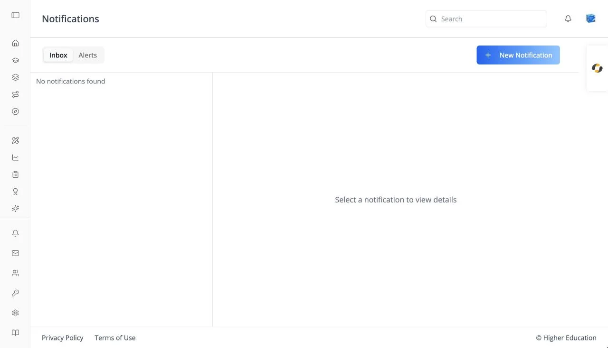

# Notification Inbox

## Overview

The notification inbox is the full-page list of every notification you have received: announcements from your organization, course alerts, and automatic messages such as enrollment confirmations. The top bar reads "Notifications".

The page has two panes: the list on the left and the selected notification on the right. On a phone, a notification opens in a pop-up instead.

Open it from **Notifications** at the bottom of the left rail, or from **View all** in the bell dropdown in the top bar. A link to one notification (`/notifications/<id>`) opens the inbox with that notification selected.

## Target Audience

**Learner** | **Administrator** (the Alerts tab and New Notification button)

## Features

#### Inbox / Alerts
**Inbox** is your notifications. **Alerts** is the administrator's view of automatic alerts; see [Alerts](alerts.md).

#### Notification list
Newest first. Each entry shows a blue dot when unread, the title, a two-line preview, and when it arrived ("Just now", "N hours ago", "Yesterday", or the date). Click one to open it and mark it read. Empty: "No notifications found".

#### Notification detail
The full notification: its title, the exact date and time (for example "October 8, 2026 at 4:00 PM"), and the formatted message. Before you pick one: "Select a notification to view details".

#### Mark all as read
Clears every unread dot and the badge on the bell.

#### New Notification (administrators)
Sends a notification to people in your organization. See [OS: Notification Inbox](../../os/notifications/inbox.md#new-notification-administrators) for the form.

## How to Use

#### Step 1: Open the inbox
Click **Notifications** in the left rail, or **View all** under the bell.

#### Step 2: Read
Click a notification to read it in full.

#### Step 3: Catch up
Click **Mark all as read** when you are done.
