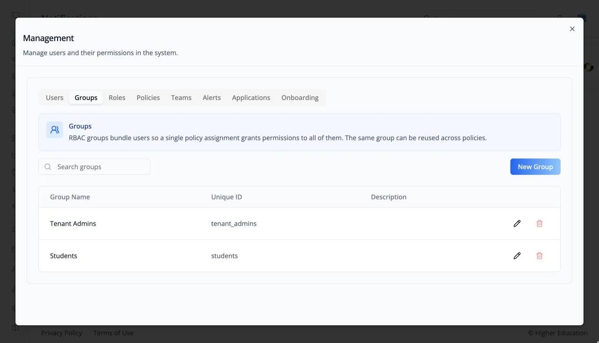

# Organization Settings

## Overview

Organization settings are where administrators run the organization behind the LMS: invite people, manage users and permissions, connect AI models and data sources, set up paid access, and change advanced options. These are shared ibl.ai screens, the same ones used in OS, so each is documented once in the [OS Organization Settings](../../os/organization-settings/organization.md) section and linked from here.

There are two ways in:

- **The sidebar footer.** The icons at the bottom of the left rail each open one area in a panel: **Invites**, **Management**, **Integrations**, **Monetization**, and **Advanced**. See [Navigating the LMS](../getting-started/navigation.md#left-rail-footer).
- **The organization name in your avatar menu.** Opens the full settings dialog with every area as tabs, starting on **Organization**.

## Target Audience

**Administrator** (some areas are open to users granted a specific permission)

## Areas

| Area | What it covers | Documentation |
|---|---|---|
| **Organization** | Name, branding, and organization-wide options. Avatar menu only | [Organization](../../os/organization-settings/organization.md) |
| **Invites** | Invite people to join | [Users](../../os/organization-settings/users.md) |
| **Management** | Users, Groups, Roles, Policies, Teams, and Alerts, plus Applications and Onboarding | [Users](../../os/organization-settings/users.md) · [Groups](../../os/organization-settings/groups.md) · [Roles](../../os/organization-settings/roles.md) · [Policies](../../os/organization-settings/policies.md) · [Teams](../../os/organization-settings/teams.md) · [Alerts](../../os/organization-settings/alerts.md) |
| **Integrations** | LLMs, Data Sources, and APIs | [LLM Integrations](../../os/organization-settings/integrations-llms.md) · [Data Source Integrations](../../os/organization-settings/integrations-data-sources.md) |
| **Monetization** | Paywalls, pricing, and revenue. When the organization sells access | [Monetization](../../os/organization-settings/monetization.md) |
| **Billing** | Your subscription. Avatar menu only | [Billing](../../os/organization-settings/billing.md) |
| **Memory** | Whether agents remember users, and the memories they keep. Avatar menu only | [Memory](../../os/organization-settings/memory.md) |
| **Virtual Machine** | Network policies and secrets for agent sandboxes. Avatar menu only | [Virtual Machine](../../os/organization-settings/virtual-machine.md) |
| **Advanced** | Advanced organization settings | [Advanced](../../os/organization-settings/advanced.md) |

#### LMS settings in Advanced
Several LMS behaviors described in these docs are organization settings, for example:

- Whether the [Discover page](../catalog/discover.md) is on ("Discover page").
- What the [Home](../catalog/home.md) course rail shows ("Dashboard Courses") and its tagline ("Welcome Tagline").
- Whether the [Start screen](../getting-started/start-screen.md) runs ("Start Screen"), and which of its slides appear.
- Whether the [AI agent tab](../getting-started/navigation.md#ai-agent-tab) is shown, and which agent it opens by default.
- Whether the skill leaderboard, resumes, and assigned content appear on [profiles](../profile/activity.md).
- Voice autoplay and agent-based unit completion in [agent-led courses](../course/agent.md).

## How to Use

#### Step 1: Open the area you need
Click its icon at the bottom of the left rail, or open your avatar menu and click the organization name.

#### Step 2: Follow the shared guide
Use the linked OS page for the fields and steps.
