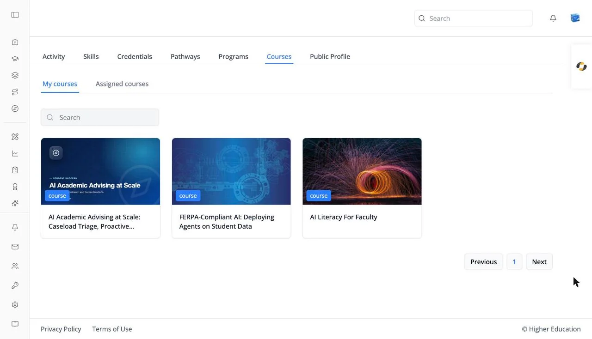

# Profile: Courses

## Overview

The Courses tab of your learner profile lists the courses you are in. For the same list with catalog filters, click **Courses** in the left rail.

## Target Audience

**Learner**

## Features

#### My courses / Assigned courses
Courses you enrolled in, and courses your organization assigned to you. **Assigned courses** is hidden when your organization doesn't use assignments.

#### Course cards
12 per page, with **Previous** and **Next**. Click one to open its [course page](../catalog/course-about.md). Empty: "No courses found."

#### Search
Filters your courses by name.

## How to Use

#### Step 1: Find a course
Search or page through your courses.

#### Step 2: Open it
Click a card, then **Access Course**.
