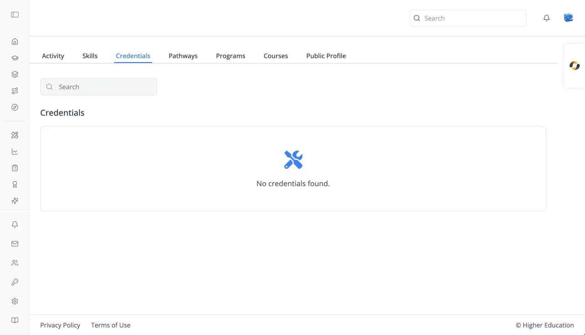

# Credentials

## Overview

Credentials lists the certificates and badges you have earned: "Credentials you have earned." Courses award them when you complete or pass them, as set up by the course team in [Settings](../course-administration/settings.md).

Open it from the **Credentials** icon (an award ribbon) in the left rail, or from the Credentials tab of your [learner profile](activity.md).

## Target Audience

**Learner**

## Features

#### Credential cards
Each card shows the credential's name, the course it came from, and "Earned on" with the date. With none yet: "No credentials found."

#### Search
Type at least three characters into **Search** to filter by name.

#### Credential Details
Click a card to open **Credential Details**: who issued it, the sentence "A completion credential for {course} was issued to {name} on {date}.", and the **Course** and **Issued on** details.

#### Download Certificate
Opens your browser's print dialog for the certificate, so you can print it or save it as a PDF.

## How to Use

#### Step 1: Find a credential
Open **Credentials** and search if you have many.

#### Step 2: Save a copy
Click it, then **Download Certificate**, and choose **Save as PDF** in the print dialog.
