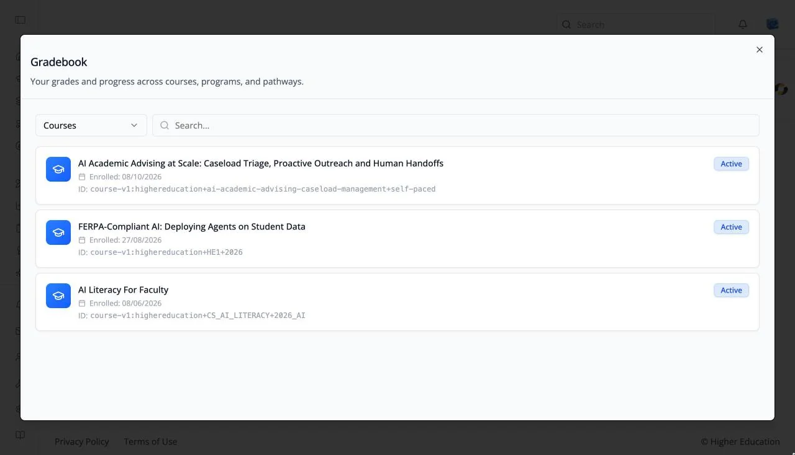

# Gradebook

## Overview

The Gradebook brings together your grades and progress across everything you are enrolled in: "Your grades and progress across courses, programs, and pathways."

Open it from the **Gradebook** icon (a clipboard) in the left rail, or from the **Gradebook** tab of the [profile dialog](profile-dialog.md).

## Target Audience

**Learner**

## Features

#### Content type
The selector at the top left switches the list between **Courses**, **Programs**, **Pathways**, **Credentials**, and **Skills**.

#### Search
"Search..." narrows the list by name.

#### Items
Each item shows its name, the date you enrolled, its ID, and a status badge such as **Active**. Open a course's [Progress tab](../course/progress.md) for the full breakdown.

## How to Use

#### Step 1: Open the Gradebook
Click **Gradebook** in the left rail.

#### Step 2: Choose what to review
Choose **Courses**, **Programs**, or **Pathways** in the selector, and search for an item if the list is long.
