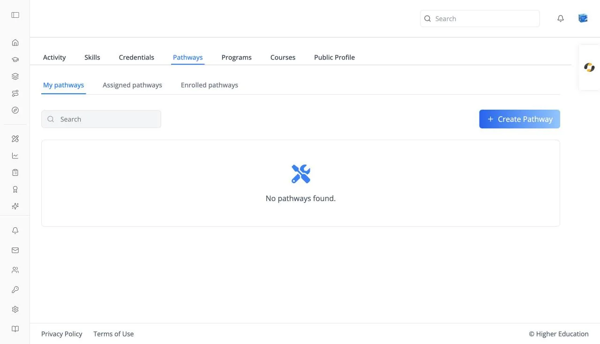
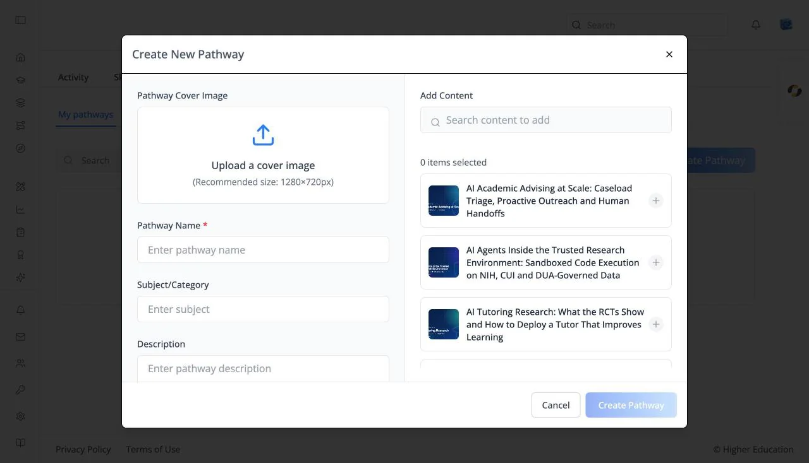

# Profile: Pathways

## Overview

The Pathways tab of your learner profile lists the pathways you have built, been assigned, or enrolled in, and is where you create your own pathway from courses and resources.

## Target Audience

**Learner**

## Features

#### My pathways / Assigned pathways / Enrolled pathways
Three views: pathways you created, pathways assigned to you by your organization, and pathways you enrolled in. **Assigned pathways** is hidden when your organization doesn't use assignments.

#### Pathway cards
Each card shows the banner, a **PATHWAY** badge, the name, and your **Progress**. Click one to open its [pathway page](../catalog/pathways.md). Empty: "No pathways found."

#### Search
Type at least three characters into **Search** to filter by name.

#### Create Pathway

On **My pathways**, opens **Create New Pathway**:

- **Pathway Name** (required), **Subject/Category**, and **Description**.
- **Add Content**: search ("Search content to add") for courses and resources, and select them. A counter shows "{n} items selected".

Click **Create Pathway**; it is available once there is a name and at least one item. New pathways are private to you.

## How to Use

#### Step 1: Create a pathway
On **My pathways**, click **Create Pathway**, name it, and add the courses you want to take in order.

#### Step 2: Follow it
Open the pathway from its card and work through the items. Your progress shows on the card.
