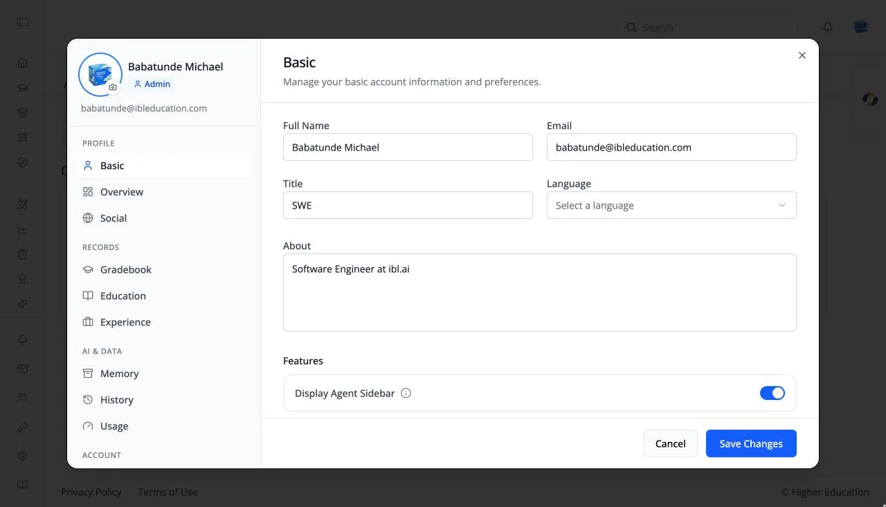

# Profile Dialog

## Overview

The profile dialog holds your account details and personal records. It is the same shared dialog used across ibl.ai applications, so most of its tabs are documented once, in the OS section, and linked from here.

Open it from your avatar in the top-right corner: choose **Profile**. It opens on the **Basic** tab. The left side shows your photo (click it to upload a new one), your name, and an **Admin** or **User** badge, above the tabs in four groups: **Profile**, **Records**, **AI & data**, and **Account**.

## Target Audience

**Learner** | **Administrator**

## Tabs

| Group | Tab | What it holds | Shown when |
|---|---|---|---|
| Profile | **Basic** | Full name, email, title, language, and an About section. See [Profile: Basic](../../os/profile/basic.md) | Always |
| Profile | **Overview** | "Your courses, conversations, AI usage and memory, all in one place." | Always |
| Profile | **Social** | Facebook, LinkedIn, and X links. See [Profile: Social](../../os/profile/social.md) | Always |
| Records | **Gradebook** | Your grades across courses, programs, and pathways. See [Gradebook](gradebook.md) | Opened from the avatar menu |
| Records | **Education** | Education, credentials, and skills. See [Profile: Education](../../os/profile/education.md) | Always |
| Records | **Experience** | Work experience and your resume. See [Profile: Experience](../../os/profile/experience.md) and [Resume](../../os/profile/experience-resume.md) | Always |
| Records | **Purchases** | What you have bought. See [Profile: Purchases](../../os/profile/purchases.md) | Your organization sells access |
| AI & data | **Memory** | What AI agents remember about you. See [Profile: Memory](../../os/profile/memory.md) | Memory is on for your organization |
| AI & data | **History** | Your conversations with AI agents. See [Profile: History](../../os/profile/history.md) | Always |
| AI & data | **Usage** | Your AI usage | Not shown to watchers |
| Account | **Privacy** | Chat privacy controls. See [Profile: Privacy](../../os/profile/privacy.md) | Your organization lets users control chat privacy |
| Account | **Security** | Password reset and account deletion. See [Profile: Security](../../os/profile/security.md) | Always |
| Account | **Advanced** | Desktop app settings | In the desktop app only |

## Features

#### Display Agent Sidebar
The **Features** section of the Basic tab has one LMS-specific switch: **Display Agent Sidebar**. Turn it off to hide the [AI agent tab](../getting-started/navigation.md#ai-agent-tab) on the right edge of every page. Turn it on again to bring it back, then click **Save Changes**.

#### Saving
The Basic and Social tabs save with **Save Changes**; **Cancel** discards your edits.

## How to Use

#### Step 1: Open your profile
Click your avatar and choose **Profile**.

#### Step 2: Update your details
Edit your name, title, and About on **Basic**, add links on **Social**, and click **Save Changes**.

#### Step 3: Add your records
Add your education and work history on **Education** and **Experience**, and upload your resume.
