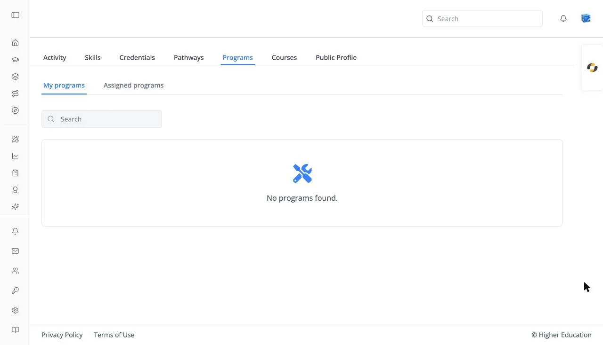

# Profile: Programs

## Overview

The Programs tab of your learner profile lists the programs you are in, with your progress in each.

## Target Audience

**Learner**

## Features

#### My programs / Assigned programs
Programs you enrolled in, and programs your organization assigned to you. **Assigned programs** is hidden when your organization doesn't use assignments.

#### Program cards
Each card shows a **PROGRAM** badge, the name, and your **Progress**. Click one to open its [program page](../catalog/programs.md). Empty: "No programs found."

#### Search
Type at least three characters into **Search** to filter by name.

## How to Use

#### Step 1: Check your programs
Open the tab to see your progress in each program.

#### Step 2: Continue
Click a program to open it and pick its next course.
