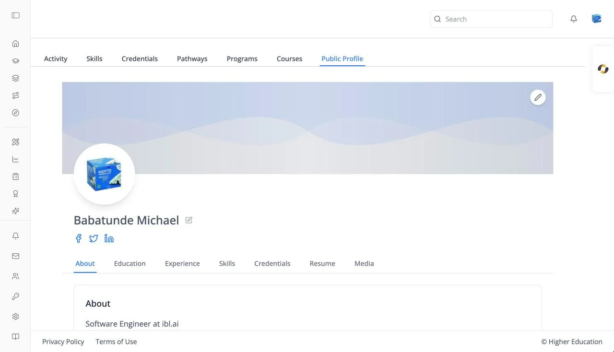

# Profile: Public Profile

## Overview

Public Profile is your profile as other people see it: your banner, photo, name, bio, and social links, followed by your education, experience, skills, credentials, resume, and media. It is the last tab of your [learner profile](activity.md).

The pencil buttons on the banner and beside your name open the [profile dialog](profile-dialog.md), where you edit these details.

## Target Audience

**Learner**

## Features

#### About
Your bio.

#### Education
Each entry with its degree, institution, years ("Present" if ongoing), and grade. Click the pencil to edit it. Empty: "No education found."

#### Experience
Headed **Work Experience**: each role with its title, company, and years. Click the pencil to edit it. Empty: "No experience found."

#### Skills
Your earned, self-reported, and desired [skills](skills.md), read-only.

#### Credentials
Your earned [credentials](credentials.md), read-only.

#### Resume
Your uploaded resume with a viewer: **Previous Page**, "Page X of Y", **Next Page**, zoom out, zoom in, **Rotate Left**, and **Rotate Right**. Hidden when your organization doesn't use resumes. Empty: "No resume found."

#### Media
Add files and links to show on your profile. Under **Upload Media**, choose **File Upload** to attach a file (up to 25MB; tick **This is a resume** for a PDF resume) or **Link Upload** to add a URL to a website, document, or video, then click **Upload File** or **Add Link**. Everything you have added appears under **Uploaded Media**. Empty: "No media found."

## How to Use

#### Step 1: Check how you appear
Open **Public Profile** and look through each tab.

#### Step 2: Fill the gaps
Click a pencil to add your bio, education, or experience.

#### Step 3: Show your work
On **Media**, upload files or add links to work you are proud of.
